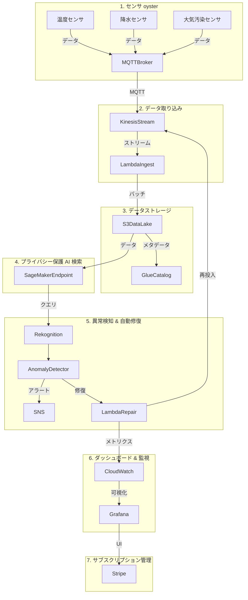

# AIオブザーバビリティプラットフォームで実現する気候レジリエンス

クラウドホステッド環境センサデータ監視システムの設計・実装ガイド

---

## はじめに

気候変動対策に不可欠な環境センサデータは、都市やNGO、研究機関にとって貴重な資産です。しかし、センサネットワークはノイズや障害、データ漏洩リスクに脆弱であり、リアルタイムで信頼性を確保することは容易ではありません。

本記事では、クラウドホステッドのオブザーバビリティプラットフォームを構築し、プライバシー保護を組み込んだAI検索機能、異常検知と自動修復のパイプラインを実装し、Stripeによるサブスクリプションで簡単に導入できるフローを提示します。

## システム全体アーキテクチャ



- **データ取り込み**: MQTT → Kinesis → Lambda
- **ストレージ**: S3 データレイク + Glue カタログ
- **検索**: SageMaker エンドポイント（差分プライバシー付き検索）
- **異常検知**: IsolationForest + LSTM（SageMaker）
- **自動修復**: Lambda による役割補完とリトライ
- **可視化**: Grafana + CloudWatch
- **サブスクリプション**: Stripe で課金管理

## データ取り込みとストレージ

### 1. MQTT から Kinesis へのブリッジ

```python
# lambda_ingest.py
import json
import boto3

kinesis = boto3.client('kinesis', region_name='ap-northeast-1')

def handler(event, context):
    for record in event['records']:
        payload = json.loads(record['data'])
        # タイムスタンプを付与
        payload['ts'] = payload.get('ts', int(time.time()))
        # Kinesis にプッシュ
        kinesis.put_record(
            StreamName='EnvSensorStream',
            Data=json.dumps(payload).encode('utf-8'),
            PartitionKey=payload['sensor_id']
        )
```

- **メリット**: スケーラブルで低レイテンシ。
- **ポイント**: `PartitionKey` をセンサ ID で統一し、順序を保つ。

### 2. S3 データレイク & Glue Catalog

```bash
aws s3 mb s3://env-sensor-data
aws s3 cp ./data s3://env-sensor-data/raw/ --recursive
```

Glue でテーブルを作成し、**Parquet** 形式で圧縮。

```sql
CREATE EXTERNAL TABLE IF NOT EXISTS env_sensor (
  sensor_id STRING,
  ts BIGINT,
  measurement DOUBLE,
  unit STRING
) 
STORED AS PARQUET
LOCATION 's3://env-sensor-data/raw/';
```

- **メリット**: コスト効率とクエリ高速化。
- **ポイント**: パーティションキーを `ts` の年月で設定し、クエリ範囲を狭める。

## プライバシー保護を備えた AI 検索

### 1. 差分プライバシー付きベクトル検索

- **手法**:
  - 事前に **FAISS** で埋め込みベクトルを作成。
  - **Laplace** ノイズを各ベクトルに加えて差分プライバシーを確保。
- **実装例**:

```python
# sagemaker_search.py
import json
import boto3
import numpy as np
import faiss

def handler(event, context):
    query = event['query']['text']
    # 事前学習済みモデルで埋め込みを生成
    embed = model.encode(query)  # 例えば SentenceTransformer
    # Laplace ノイズ追加
    epsilon = 0.5
    scale = 1/epsilon
    noise = np.random.laplace(0, scale, embed.shape)
    noisy_embed = embed + noise

    # FAISS インデックス検索
    index = faiss.read_index('/opt/index.faiss')
    D, I = index.search(noisy_embed.reshape(1,-1), k=10)
    results = [index_to_doc(i) for i in I[0]]
    return {'results': results}
```

- **ポイント**:
  - `epsilon` を低く設定するとプライバシーが高まるが、精度が低下。
  - 監査ログを CloudWatch に送信し、**GDPR** 等に準拠。

### 2. 検索フロントエンド (Grafana パネル)

- **Grafana** の **JSON API プラグイン** を利用し、検索結果を可視化。
- クエリパラメータは URL に `?q=...` で渡し、SageMaker エンドポイントへリクエスト。

```json
{
  "targets": [
    {
      "type": "json",
      "url": "https://<endpoint>/search",
      "params": {
        "q": "$__dashvalue"
      },
      "format": "table"
    }
  ]
}
```

## 異常検知と通知

### 1. IsolationForest + LSTM で双方向検知

```python
# anomaly_detector.py
import json
import numpy as np
import joblib
from sklearn.ensemble import IsolationForest

# 奴隷
iforest = joblib.load('/opt/iforest.pkl')
lstm = joblib.load('/opt/lstm.pkl')

def handler(event, context):
    data = json.loads(event['body'])
    ts, val = data['ts'], data['measurement']
    # 1 次元の IsolationForest
    if iforest.predict([[val]]) == -1:
        alert = True
    else:
        # 時系列 LSTM で未来予測
        pred = lstm.predict([[val]])
        if abs(pred - val) > 0.3 * val:
            alert = True
        else:
            alert = False
    if alert:
        sns.publish(
            TopicArn='arn:aws:sns:ap-northeast-1:123456789012:SensorAlert',
            Message=json.dumps(data))
    return {'status': 'ok'}
```

- **メリット**: 低レイテンシ + 高精度。
- **ポイント**: データが多様な場合は **Gaussian Process** を併用。

### 2. 通知 (SNS → Email / Slack)

```yaml
# sns_topic.yaml
Resources:
  SensorAlertTopic:
    Type: AWS::SNS::Topic
    Properties:
      Subscription:
        - Protocol: email
          Endpoint: your@example.com
        - Protocol: https
          Endpoint: https://hooks.slack.com/services/TOKEN mtoto
```

- **リアルタイム** で担当者にアラートを配信。

## 自動修復ワークフロー

### 1. 欠損値補完アルゴリズム

- **KNN**・**Gaussian Process** を用いて欠損値を推定。
- 補完後は **Kinesis** に再投入し、パイプラインを継続。

```python
# lambda_repair.py
import json
import boto3
import numpy as np
from sklearn.impute import KNNImputer

kinesis = boto3.client('kinesis', region_name='ap-northeast-1')
imputer = KNNImputer(n_neighbors=5)

def handler(event, context):
    records = []
    for r in event['records']:
        payload = json.loads(r['data'])
        if payload.get('measurement') is None:
            # 欠損値を補完
            imputed = imputer.fit_transform([[payload['ts'], 0]])[0][1]
            payload['measurement'] = float(imputed)
        records.append({
            'Data': json.dumps(payload).encode('utf-8'),
            'PartitionKey': payload['sensor_id']
        })
    kinesis.put_records(Records=records, StreamName='EnvSensorStream')
```

### 2. リトライ & バックオフ戦略

- **Lambda Destinations** を利用し、失敗時に **SQS** へ送信。
- SQS で **FIFO** キューを設定し、**Visibility Timeout** を 60 秒。

## サブスクリプションフロー

| プラン | 月額 | 内容 |
|--------|------|------|
| Light | ¥5,000 | 1,000センサ, 1×10^5 データポイント/日 |
| Standard | ¥30,000 | 10,000 センサ, 1×10^7 データポイント/日, SLA 99.9% |
| Enterprise | ¥100,000 | 100,000 センサ, 1×10^9 データポイント/日, 24/7 サポート, カスタム SLA |

### 1. Stripe Checkout でサブスク登録

```yaml
curl https://api.stripe.com/v1/checkout/sessions \
  -u sk_test_...: \
  -d success_url=https://yourdomain.com/success?session_id={CHECKOUT_SESSION_ID} \
  -d cancel_url=https://yourdomain.com/cancel \
  -d payment_method_types[]=card \
  -d mode=subscription \
  -d line_items[0][price_data][currency]=jpy \
  -d line_items[0][price_data][product_data][name]=Standard Plan \
  -d line_items[0][price_data][unit_amount]=30000 \
  -d line_items[0][quantity]=1
```

- 上記レスポンスから `id` を取得し、フロントエンドでリダイレクト。
- **Webhook** で `invoice.payment_succeeded` を受け取り、ユーザーアカウントを有効化。

```python
# stripe_webhook.py
import os
import stripe

stripe.api_key = os.getenv('STRIPE_SECRET')

def lambda_handler(event, context):
    payload = event['body']
    sig_header = event['headers']['Stripe-Signature']
    endpoint_secret = os.getenv('STRIPE_WEBHOOK_SECRET')
    try:
        stripe_event = stripe.Webhook.construct_event(
            payload, sig_header, endpoint_secret
        )
    except ValueError:
        return {'statusCode': 400}
    except stripe.error.SignatureVerificationError:
        return {'statusCode': 400}

    if stripe_event['type'] == 'invoice.payment_succeeded':
        customer_id = stripe_event['data']['object']['customer']
        # DB にサブスクリプション情報を書き込み
        update_user_subscription(customer_id, stripe_event['data']['object'])
    return {'statusCode': 200}
```

- **DB**: DynamoDB で `user_id` と `plan` を管理。

### 2. ダッシュボードでプラン確認

- Grafana の **Variable** を使い、ユーザーのプランを切り替えて表示。

```json
{
  "name": "plan",
  "type": "query",
  "query": "SELECT plan FROM user_subscriptions WHERE user_id = '{{.UID}}'"
}
```

- Light プランではデータポイント数を制限し、超過時にアラース。

## 導入手順とデプロイ例

| ステップ | コマンド |
|----------|----------|
| 1. 事前準備 | `aws configure`（プロファイル設定） |
| 2. リソース作成 | `cdk deploy` |
| 3. データインジェスト | `aws lambda update-function-code --function-name lambda_ingest --zip-file fileb://ingest.zip` |
| 4. ストレージ & カタログ | `aws s3 sync ./raw s3://env-sensor-data/raw/` |
| 5. SageMaker モデル | `sagemaker create-model --model-name EnvSearchModel --primary-container Image=...` |
| 6. Stripe Webhook | `aws lambda add-permission --function-name stripe_webhook --statement-id stripe --action lambda:InvokeFunction --principal stripe.com` |
| 7. ダッシュボード | Grafana への API キーを設定し、パネルをインポート |

### CDK での例 (TypeScript)

```ts
// infra previsto
import * as cdk from 'aws-cdk-lib';
import { Stack, StackProps } from 'aws-cdk-lib';
import { Function, Runtime, Code } from 'aws-cdk-lib/aws-lambda';
import { Topic } from 'aws-cdk-lib/aws-sns';
import { Subscription, EmailSubscription } from 'aws-cdk-lib/aws-sns-subscriptions';

export class EnvObservabilityStack extends Stack {
  constructor(scope: Construct, id: string, props?: StackProps) {
    super(scope, id, props);

    const ingest = new Function(this, 'IngestFunction', {
      runtime: Runtime.PYTHON_3_9,
      handler: 'lambda_ingest.handler',
      code: Code.fromAsset('lambda/ingest')
    });

    const alertTopic = new Topic(this, 'SensorAlertTopic');
    alertTopic.addSubscription(new EmailSubscription('alert@example.com'));
  }
}
```

## まとめと次のステップ

1. **プライバシー保護 AI 検索** を導入し、センサデータを安全に検索。
2. **異常検知 & 自動修復** でデータ品質を自動維持。
3. **Stripe** によるサブスク管理で、導入コストを分散。
4. **Grafana** で可視化し、意思決定を加速。

次のステップとして `.gitlab-ci.yml` で CI/CD を構築し、IaC でスケールアウトを自動化することを検討してください。

---

## おわりに

このプラットフォームは、単なるデータ収集の仕組みを超え、**気候変動への対応を技術的に支える基盤**となります。環境モニタリングを次のレベルへ導く一助になれば幸いです。

**記事が役に立った方へ**
- [Stripe でサブスク登録](https://stripe.com)
- [Ko-fi で応援する](https://ko-fi.com)
- [お問い合わせ (support@envobservability.jp)](mailto:support@envobservability.jp)