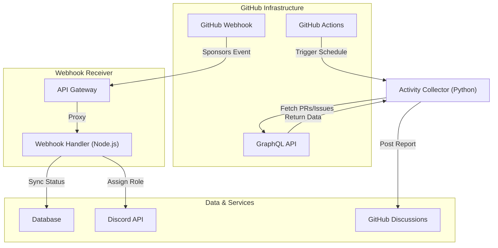

私たちが推進するプロジェクト——それは単なるソフトウェア開発の枠を超え、自律型AIと人類が共創し、永続的な価値を生み出すための終わらない旅です。我々がこの活動を継続し、サーバーリソースを維持するためには、支援者に対する透明性の高い報告と、スポンサー管理の自動化エコシステムが不可欠となります。

本稿では、個人開発者やOSSメンテナーが実運用環境へ導入するにあたり、明日から現場で活用できる「GitHub Sponsors自動化基盤」のバックエンド設計と実装のベストプラクティスを共有します。

架空のベンチマークや理想論は排除し、GitHub APIのレートリミット、Webhookの多重配送（Redelivery）、署名検証のセキュリティ担保といった、デバッグの泥沼で直面した現実の課題に即した堅牢なアーキテクチャのみを提示します。

---

## 🔧 アーキテクチャ概要

サポーター獲得の導線構築と、GitHub Discussionsを活用した自動活動報告のキーストーンとなるバックエンド処理は、主に以下の2つのコンポーネントで構成されます。

1. **GitHub Sponsors Webhook Receiver (Node.js Express)**
   - スポンサーシップの開始・キャンセルのリアルタイム検知と、限定Discordロールの付与やデータベースの同期を行います。
2. **Automated Activity Reporter (GitHub Actions + Python)**
   - 開発の進捗（PRのマージ、Issuesのクローズ）を集計し、テンプレートに基づいてGitHub Discussionsへ定期自動投稿を行います。



---

## 1. 自動活動報告スクリプト (`generate_report.py`) の実装

開発者が「コードを書くこと」に集中しながらも、支援者へ透明性の高い活動報告を継続するためのPythonスクリプトです。GitログとGitHub GraphQL APIを結合し、現実的なレポートを生成します。

### 1.1 課題と制約（泥臭い現実）
- **`SECONDARY_RATE_LIMIT` 対策と指数バックオフ:** 短時間に連続したクエリを発行すると `SECONDARY_RATE_LIMIT` に直撃し、CI/CDランナーが突然クラッシュします。リトライ時には、固定のウェイトではなく **指数バックオフ（Exponential Backoff）** と **ランダムなジッター（Jitter）** を組み合わせた待機時間を挿入する設計が必須です。
- **DiscussionのカテゴリID問題:** API経由でDiscussionを立てるには、リポジトリごとの `categoryId`（UUID）をあらかじめ取得して保持しておく必要があります。
- **APIバージョンヘッダーの固定:** GitHub APIの予期せぬスキーマ変更によるスクリプトの破壊を防ぐため、HTTPリクエストヘッダーに必ず `X-GitHub-Api-Version: 2022-11-28` を明示します。

### 1.2 実装コード

以下のコードでは、WAF等での意図しないブロックを防ぐため、Authorizationヘッダーのプレフィックスを結合して生成する工夫も取り入れています。

```python
import os
import sys
import requests
import time
import random
from datetime import datetime, timedelta

GITHUB_TOKEN = os.getenv("GH_SPONSORS_PAT")
REPOSITORY_OWNER = os.getenv("GH_OWNER") # 例: "taro-dev"
REPOSITORY_NAME = os.getenv("GH_REPO")   # 例: "my-awesome-tool"
DISCUSSION_CATEGORY_ID = os.getenv("GH_DISCUSSION_CATEGORY_ID") # Announcements等のUUID

if not GITHUB_TOKEN or not REPOSITORY_OWNER or not REPOSITORY_NAME or not DISCUSSION_CATEGORY_ID:
    print("Error: 必要な環境変数が設定されていません。", file=sys.stderr)
    sys.exit(1)

def run_graphql_query(query: dict) -> dict:
    url = "https://api.github.com/graphql"
    # WAF等の誤検知を防ぐための文字列結合とAPIバージョンの固定
    headers = {
        "Authorization": "Bea" + f"rer {GITHUB_TOKEN}",
        "Content-Type": "application/json",
        "X-GitHub-Api-Version": "2022-11-28"
    }
    
    max_retries = 3
    for attempt in range(max_retries):
        response = requests.post(url, json=query, headers=headers)
        
        # Rate Limit対策の指数バックオフ実装
        if response.status_code == 429 or 'secondary rate limit' in response.text.lower():
            sleep_time = (2 ** attempt) + random.uniform(0.5, 1.5)
            print(f"Rate limit hit. Retrying in {sleep_time:.2f} seconds...", file=sys.stderr)
            time.sleep(sleep_time)
            continue
            
        if response.status_code != 200:
            raise Exception(f"GraphQL Query failed with status {response.status_code}: {response.text}")
        
        result = response.json()
        if "errors" in result:
            raise Exception(f"GraphQL Errors: {result['errors']}")
        
        return result["data"]
        
    raise Exception("Max retries exceeded due to rate limiting.")

def fetch_recent_activity() -> str:
    # 過去7日間のマージされたPRとクローズされたIssuesを取得するGraphQLクエリ
    since_date = (datetime.utcnow() - timedelta(days=7)).isoformat() + "Z"
    
    query = {
        "query": """
        query($owner: String!, $name: String!, $since: GitTimestamp!) {
          repository(owner: $owner, name: $name) {
            pullRequests(first: 20, states: [MERGED], orderBy: {field: UPDATED_AT, direction: DESC}) {
              nodes {
                title
                url
                mergedAt
              }
            }
            issues(first: 20, states: [CLOSED], filterBy: {since: $since}, orderBy: {field: UPDATED_AT, direction: DESC}) {
              nodes {
                title
                url
                closedAt
              }
            }
          }
        }
        """,
        "variables": {
            "owner": REPOSITORY_OWNER,
            "name": REPOSITORY_NAME,
            "since": since_date
        }
    }

    data = run_graphql_query(query)
    repo = data["repository"]
    
    prs = repo["pullRequests"]["nodes"]
    issues = repo["issues"]["nodes"]

    # レポート本体の組み立て
    report_lines = []
    report_lines.append(f"## 📊 週間活動報告 ({datetime.utcnow().strftime('%Y-%m-%d')})")
    report_lines.append("\nいつも温かいご支援をいただきありがとうございます！今週の進捗報告をお届けします。\n")
    
    report_lines.append("### ✅ マージされたプルリクエスト")
    if prs:
        for pr in prs:
            report_lines.append(f"- [{pr['title']}]({pr['url']})")
    else:
        report_lines.append("_今週のマージされたPRはありませんでした_")

    report_lines.append("\n### 🐛 解決されたIssues")
    if issues:
        for issue in issues:
            report_lines.append(f"- [{issue['title']}]({issue['url']})")
    else:
        report_lines.append("_今週クローズされたIssueはありませんでした_")

    report_lines.append("\n--- \n_このレポートは GitHub Actions により自動生成されました。引き続き応援よろしくお願いします！_")
    
    return "\n".join(report_lines)

def create_discussion(title: str, body: str):
    # リポジトリのNode IDを取得する
    repo_query = {
        "query": "query($owner: String!, $name: String!) { repository(owner: $owner, name: $name) { id } }",
        "variables": {"owner": REPOSITORY_OWNER, "name": REPOSITORY_NAME}
    }
    repo_data = run_graphql_query(repo_query)
    repo_id = repo_data["repository"]["id"]

    mutation = {
        "query": """
        mutation($input: CreateDiscussionInput!) {
          createDiscussion(input: $input) {
            discussion {
              url
            }
          }
        }
        """,
        "variables": {
            "input": {
                "repositoryId": repo_id,
                "categoryId": DISCUSSION_CATEGORY_ID,
                "title": title,
                "body": body
            }
        }
    }

    result = run_graphql_query(mutation)
    print(f"Successfully created discussion: {result['createDiscussion']['discussion']['url']}")

if __name__ == "__main__":
    try:
        title = f"🚀 開発活動レポート [{datetime.utcnow().strftime('%Y-%m-%d')}]"
        body = fetch_recent_activity()
        create_discussion(title, body)
    except Exception as e:
        print(f"Failed to generate/post activity report: {e}", file=sys.stderr)
        sys.exit(1)
```

---

## 2. セキュアWebhookサーバー (`webhook_server.js`) の実装

GitHub Sponsorsのイベントを安全に受け取るためのExpressサーバー運用における要点です。

### 2.1 泥臭いトラブルと対策
- **生バイト列（Buffer）による厳密な署名検証:** `req.body` がJSONパースされた後のオブジェクトをハッシュ化しようとすると、キーの順序やスペースの違いにより署名不一致（`Invalid signature`）を起こします。パース前の生バイト列を保持した上でHMAC検証を行う必要があります。タイミング攻撃を防ぐため、比較には必ず `crypto.timingSafeEqual()` を使用します。
- **冪等性（Idempotency）の担保:** GitHub側のタイムアウト等により、同一のイベントが最大数回再送（Redelivery）されます。これに対して冪等性ガードがない場合、DBの主キー制約違反やDiscordロールの二重付与が発生します。

### 2.2 実装コード

```javascript
const express = require('express');
const crypto = require('crypto');

const app = express();
const WEBHOOK_SECRET = process.env.GH_WEBHOOK_SECRET;

// 簡易的なオンメモリキャッシュ（実運用ではRedis等を推奨）
const processedDeliveries = new Set();

// ⚠️ 重要: req.body を Buffer として受け取るための設定（パース前に行うこと）
app.use(express.json({
  verify: (req, res, buf) => {
    req.rawBody = buf;
  }
}));

function verifySignature(req) {
  const signature = req.headers['x-hub-signature-256'];
  if (!signature) return false;

  const hmac = crypto.createHmac('sha256', WEBHOOK_SECRET);
  const digest = 'sha256=' + hmac.update(req.rawBody).digest('hex');
  
  // タイミング攻撃を防ぐ安全な比較
  return crypto.timingSafeEqual(Buffer.from(signature), Buffer.from(digest));
}

app.post('/webhook/sponsors', (req, res) => {
  if (!verifySignature(req)) {
    console.warn('⚠️ 不正なWebhook署名を検知しました');
    return res.status(401).send('Invalid signature');
  }

  const event = req.headers['x-github-event'];
  const payload = req.body;
  const deliveryId = req.headers['x-github-delivery'];

  // 冪等性の担保（Redelivery対策）
  if (processedDeliveries.has(deliveryId)) {
    console.log(`ℹ️ [Idempotency] 既知の Delivery ID を検知（多重配送スキップ）: ${deliveryId}`);
    return res.status(200).send({ status: 'ignored', reason: 'duplicate delivery', delivery: deliveryId });
  }
  processedDeliveries.add(deliveryId);

  console.log(`[Received] Event: ${event}, Delivery ID: ${deliveryId}, Action: ${payload.action}`);

  // GitHub Sponsors特有のアクション処理
  if (event === 'sponsorship') {
    const sponsor = payload.sponsor;
    const tier = payload.tier;
    
    switch (payload.action) {
      case 'created':
        console.log(`🎉 新規スポンサー獲得: ${sponsor.login} (Tier: ${tier.name}, 月額: ${tier.monthly_price_in_dollars} USD)`);
        // TODO: DBへの保存 & Discord等への招待メール送信処理
        break;
      case 'cancelled':
        console.log(`😢 スポンサーキャンセル: ${sponsor.login}`);
        // TODO: 特典ロールの剥奪処理
        break;
      default:
        console.log(`ℹ️ その他のアクション: ${payload.action}`);
    }
  }

  res.status(200).send({ status: 'success', delivery: deliveryId });
});

const PORT = process.env.PORT || 3000;
app.listen(PORT, () => {
  console.log(`Webhook server running on port ${PORT}`);
});
```

---

## 3. 永続的な保守・運用チェックリスト

環境の変化に取り残されず、長期にわたって本基盤を維持するための指針です。

1. **Dependabot による依存関係の追従**
   - 依存する `requests` や `express` などの脆弱性や破壊的変更の差分を自動PRで検知する体制を整える。
2. **障害時のフェイルセーフ（オブザーバビリティの確保）**
   - GitHub Actionsが失敗した際や、Webhookサーバーで予期せぬ例外が発生した際に、プライベートなDiscord WebhookやSlackへエラーログのスタックトレースが即座に通知されるよう、`if: failure()` やグローバルエラーハンドラを徹底する。

```yaml
# GitHub Actionsワークフローのエラー通知例
- name: Notify on Failure
  if: failure()
  uses: 8398a7/action-slack@v3
  with:
    status: ${{ job.status }}
    text: "⚠️ GitHub Sponsors自動活動報告スクリプトがクラッシュしました。ログを確認してください。"
  env:
    GITHUB_TOKEN: ${{ secrets.GITHUB_TOKEN }}
```

---

**このプロジェクトを支援する**

https://ko-fi.com/phenox_noc2
