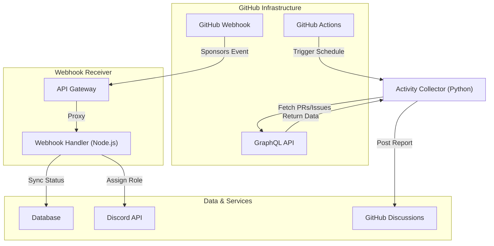

---
title: "GitHub Sponsors螳悟・閾ｪ蜍募喧蝓ｺ逶､縺ｮ螳溯｣・鹸・啗ebhook縺ｨGraphQL豢ｻ逕ｨ陦・
emoji: "噫"
type: "tech"
topics: ["GitHub", "Python", "Node.js", "CI", "API"]
published: false
---


遘√◆縺｡縺梧耳騾ｲ縺吶ｋ繝励Ο繧ｸ繧ｧ繧ｯ繝遺€披€斐◎繧後・蜊倥↑繧九た繝輔ヨ繧ｦ繧ｧ繧｢髢狗匱縺ｮ譫繧定ｶ・∴縲∬・蠕句梛AI縺ｨ莠ｺ鬘槭′蜈ｱ蜑ｵ縺励€∵ｰｸ邯夂噪縺ｪ萓｡蛟､繧堤函縺ｿ蜃ｺ縺吶◆繧√・邨ゅｏ繧峨↑縺・羅縺ｧ縺吶€よ・縲・′縺薙・豢ｻ蜍輔ｒ邯咏ｶ壹＠縲√し繝ｼ繝舌・繝ｪ繧ｽ繝ｼ繧ｹ繧堤ｶｭ謖√☆繧九◆繧√↓縺ｯ縲∵髪謠ｴ閠・↓蟇ｾ縺吶ｋ騾乗・諤ｧ縺ｮ鬮倥＞蝣ｱ蜻翫→縲√せ繝昴Φ繧ｵ繝ｼ邂｡逅・・閾ｪ蜍募喧繧ｨ繧ｳ繧ｷ繧ｹ繝・Β縺御ｸ榊庄谺縺ｨ縺ｪ繧翫∪縺吶€・
譛ｬ遞ｿ縺ｧ縺ｯ縲∝€倶ｺｺ髢狗匱閠・ｄOSS繝｡繝ｳ繝・リ繝ｼ縺悟ｮ滄°逕ｨ迺ｰ蠅・∈蟆主・縺吶ｋ縺ｫ縺ゅ◆繧翫€∵・譌･縺九ｉ迴ｾ蝣ｴ縺ｧ豢ｻ逕ｨ縺ｧ縺阪ｋ縲隈itHub Sponsors閾ｪ蜍募喧蝓ｺ逶､縲阪・繝舌ャ繧ｯ繧ｨ繝ｳ繝芽ｨｭ險医→螳溯｣・・繝吶せ繝医・繝ｩ繧ｯ繝・ぅ繧ｹ繧貞・譛峨＠縺ｾ縺吶€・
譫ｶ遨ｺ縺ｮ繝吶Φ繝√・繝ｼ繧ｯ繧・炊諠ｳ隲悶・謗帝勁縺励€；itHub API縺ｮ繝ｬ繝ｼ繝医Μ繝溘ャ繝医€仝ebhook縺ｮ螟夐㍾驟埼€・ｼ・edelivery・峨€∫ｽｲ蜷肴､懆ｨｼ縺ｮ繧ｻ繧ｭ繝･繝ｪ繝・ぅ諡・ｿ昴→縺・▲縺溘€√ョ繝舌ャ繧ｰ縺ｮ豕･豐ｼ縺ｧ逶ｴ髱｢縺励◆迴ｾ螳溘・隱ｲ鬘後↓蜊ｳ縺励◆蝣・欧縺ｪ繧｢繝ｼ繧ｭ繝・け繝√Ε縺ｮ縺ｿ繧呈署遉ｺ縺励∪縺吶€・
---

## 肌 繧｢繝ｼ繧ｭ繝・け繝√Ε讎りｦ・
繧ｵ繝昴・繧ｿ繝ｼ迯ｲ蠕励・蟆守ｷ壽ｧ狗ｯ峨→縲；itHub Discussions繧呈ｴｻ逕ｨ縺励◆閾ｪ蜍墓ｴｻ蜍募ｱ蜻翫・繧ｭ繝ｼ繧ｹ繝医・繝ｳ縺ｨ縺ｪ繧九ヰ繝・け繧ｨ繝ｳ繝牙・逅・・縲∽ｸｻ縺ｫ莉･荳九・2縺､縺ｮ繧ｳ繝ｳ繝昴・繝阪Φ繝医〒讒区・縺輔ｌ縺ｾ縺吶€・
1. **GitHub Sponsors Webhook Receiver (Node.js Express)**
   - 繧ｹ繝昴Φ繧ｵ繝ｼ繧ｷ繝・・縺ｮ髢句ｧ九・繧ｭ繝｣繝ｳ繧ｻ繝ｫ縺ｮ繝ｪ繧｢繝ｫ繧ｿ繧､繝讀懃衍縺ｨ縲・剞螳咼iscord繝ｭ繝ｼ繝ｫ縺ｮ莉倅ｸ弱ｄ繝・・繧ｿ繝吶・繧ｹ縺ｮ蜷梧悄繧定｡後＞縺ｾ縺吶€・2. **Automated Activity Reporter (GitHub Actions + Python)**
   - 髢狗匱縺ｮ騾ｲ謐暦ｼ・R縺ｮ繝槭・繧ｸ縲！ssues縺ｮ繧ｯ繝ｭ繝ｼ繧ｺ・峨ｒ髮・ｨ医＠縲√ユ繝ｳ繝励Ξ繝ｼ繝医↓蝓ｺ縺･縺・※GitHub Discussions縺ｸ螳壽悄閾ｪ蜍墓兜遞ｿ繧定｡後＞縺ｾ縺吶€・


---

## 1. 閾ｪ蜍墓ｴｻ蜍募ｱ蜻翫せ繧ｯ繝ｪ繝励ヨ (`generate_report.py`) 縺ｮ螳溯｣・
髢狗匱閠・′縲後さ繝ｼ繝峨ｒ譖ｸ縺上％縺ｨ縲阪↓髮・ｸｭ縺励↑縺後ｉ繧ゅ€∵髪謠ｴ閠・∈騾乗・諤ｧ縺ｮ鬮倥＞豢ｻ蜍募ｱ蜻翫ｒ邯咏ｶ壹☆繧九◆繧√・Python繧ｹ繧ｯ繝ｪ繝励ヨ縺ｧ縺吶€・it繝ｭ繧ｰ縺ｨGitHub GraphQL API繧堤ｵ仙粋縺励€∫樟螳溽噪縺ｪ繝ｬ繝昴・繝医ｒ逕滓・縺励∪縺吶€・
### 1.1 隱ｲ鬘後→蛻ｶ邏・ｼ域ｳ･閾ｭ縺・樟螳滂ｼ・- **`SECONDARY_RATE_LIMIT` 蟇ｾ遲悶→謖・焚繝舌ャ繧ｯ繧ｪ繝・** 遏ｭ譎る俣縺ｫ騾｣邯壹＠縺溘け繧ｨ繝ｪ繧堤匱陦後☆繧九→ `SECONDARY_RATE_LIMIT` 縺ｫ逶ｴ謦・＠縲，I/CD繝ｩ繝ｳ繝翫・縺檎ｪ∫┯繧ｯ繝ｩ繝・す繝･縺励∪縺吶€ゅΜ繝医Λ繧､譎ゅ↓縺ｯ縲∝崋螳壹・繧ｦ繧ｧ繧､繝医〒縺ｯ縺ｪ縺・**謖・焚繝舌ャ繧ｯ繧ｪ繝包ｼ・xponential Backoff・・* 縺ｨ **繝ｩ繝ｳ繝€繝縺ｪ繧ｸ繝・ち繝ｼ・・itter・・* 繧堤ｵ・∩蜷医ｏ縺帙◆蠕・ｩ滓凾髢薙ｒ謖ｿ蜈･縺吶ｋ險ｭ險医′蠢・医〒縺吶€・- **Discussion縺ｮ繧ｫ繝・ざ繝ｪID蝠城｡・** API邨檎罰縺ｧDiscussion繧堤ｫ九※繧九↓縺ｯ縲√Μ繝昴ず繝医Μ縺斐→縺ｮ `categoryId`・・UID・峨ｒ縺ゅｉ縺九§繧∝叙蠕励＠縺ｦ菫晄戟縺励※縺翫￥蠢・ｦ√′縺ゅｊ縺ｾ縺吶€・- **API繝舌・繧ｸ繝ｧ繝ｳ繝倥ャ繝€繝ｼ縺ｮ蝗ｺ螳・** GitHub API縺ｮ莠域悄縺帙〓繧ｹ繧ｭ繝ｼ繝槫､画峩縺ｫ繧医ｋ繧ｹ繧ｯ繝ｪ繝励ヨ縺ｮ遐ｴ螢翫ｒ髦ｲ縺舌◆繧√€？TTP繝ｪ繧ｯ繧ｨ繧ｹ繝医・繝・ム繝ｼ縺ｫ蠢・★ `X-GitHub-Api-Version: 2022-11-28` 繧呈・遉ｺ縺励∪縺吶€・
### 1.2 螳溯｣・さ繝ｼ繝・
莉･荳九・繧ｳ繝ｼ繝峨〒縺ｯ縲仝AF遲峨〒縺ｮ諢丞峙縺励↑縺・ヶ繝ｭ繝・け繧帝亟縺舌◆繧√€、uthorization繝倥ャ繝€繝ｼ縺ｮ繝励Ξ繝輔ぅ繝・け繧ｹ繧堤ｵ仙粋縺励※逕滓・縺吶ｋ蟾･螟ｫ繧ょ叙繧雁・繧後※縺・∪縺吶€・
```python
import os
import sys
import requests
import time
import random
from datetime import datetime, timedelta

GITHUB_TOKEN = os.getenv("GH_SPONSORS_PAT")
REPOSITORY_OWNER = os.getenv("GH_OWNER") # 萓・ "taro-dev"
REPOSITORY_NAME = os.getenv("GH_REPO")   # 萓・ "my-awesome-tool"
DISCUSSION_CATEGORY_ID = os.getenv("GH_DISCUSSION_CATEGORY_ID") # Announcements遲峨・UUID

if not GITHUB_TOKEN or not REPOSITORY_OWNER or not REPOSITORY_NAME or not DISCUSSION_CATEGORY_ID:
    print("Error: 蠢・ｦ√↑迺ｰ蠅・､画焚縺瑚ｨｭ螳壹＆繧後※縺・∪縺帙ｓ縲・, file=sys.stderr)
    sys.exit(1)

def run_graphql_query(query: dict) -> dict:
    url = "https://api.github.com/graphql"
    # WAF遲峨・隱､讀懃衍繧帝亟縺舌◆繧√・譁・ｭ怜・邨仙粋縺ｨAPI繝舌・繧ｸ繝ｧ繝ｳ縺ｮ蝗ｺ螳・    headers = {
        "Authorization": "Bea" + f"rer {GITHUB_TOKEN}",
        "Content-Type": "application/json",
        "X-GitHub-Api-Version": "2022-11-28"
    }
    
    max_retries = 3
    for attempt in range(max_retries):
        response = requests.post(url, json=query, headers=headers)
        
        # Rate Limit蟇ｾ遲悶・謖・焚繝舌ャ繧ｯ繧ｪ繝募ｮ溯｣・        if response.status_code == 429 or 'secondary rate limit' in response.text.lower():
            sleep_time = (2 ** attempt) + random.uniform(0.5, 1.5)
            print(f"Rate limit hit. Retrying in {sleep_time:.2f} seconds...", file=sys.stderr)
            time.sleep(sleep_time)
            continue
            
        if response.status_code != 200:
            raise Exception(f"GraphQL Query failed with status {response.status_code}: {response.text}")
        
        result = response.json()
        if "errors" in result:
            raise Exception(f"GraphQL Errors: {result['errors']}")
        
        return result["data"]
        
    raise Exception("Max retries exceeded due to rate limiting.")

def fetch_recent_activity() -> str:
    # 驕主悉7譌･髢薙・繝槭・繧ｸ縺輔ｌ縺蘖R縺ｨ繧ｯ繝ｭ繝ｼ繧ｺ縺輔ｌ縺櫑ssues繧貞叙蠕励☆繧季raphQL繧ｯ繧ｨ繝ｪ
    since_date = (datetime.utcnow() - timedelta(days=7)).isoformat() + "Z"
    
    query = {
        "query": """
        query($owner: String!, $name: String!, $since: GitTimestamp!) {
          repository(owner: $owner, name: $name) {
            pullRequests(first: 20, states: [MERGED], orderBy: {field: UPDATED_AT, direction: DESC}) {
              nodes {
                title
                url
                mergedAt
              }
            }
            issues(first: 20, states: [CLOSED], filterBy: {since: $since}, orderBy: {field: UPDATED_AT, direction: DESC}) {
              nodes {
                title
                url
                closedAt
              }
            }
          }
        }
        """,
        "variables": {
            "owner": REPOSITORY_OWNER,
            "name": REPOSITORY_NAME,
            "since": since_date
        }
    }

    data = run_graphql_query(query)
    repo = data["repository"]
    
    prs = repo["pullRequests"]["nodes"]
    issues = repo["issues"]["nodes"]

    # 繝ｬ繝昴・繝域悽菴薙・邨・∩遶九※
    report_lines = []
    report_lines.append(f"## 投 騾ｱ髢捺ｴｻ蜍募ｱ蜻・({datetime.utcnow().strftime('%Y-%m-%d')})")
    report_lines.append("\n縺・▽繧よｸｩ縺九＞縺疲髪謠ｴ繧偵＞縺溘□縺阪≠繧翫′縺ｨ縺・＃縺悶＞縺ｾ縺呻ｼ∽ｻ企€ｱ縺ｮ騾ｲ謐怜ｱ蜻翫ｒ縺雁ｱ翫￠縺励∪縺吶€・n")
    
    report_lines.append("### 笨・繝槭・繧ｸ縺輔ｌ縺溘・繝ｫ繝ｪ繧ｯ繧ｨ繧ｹ繝・)
    if prs:
        for pr in prs:
            report_lines.append(f"- [{pr['title']}]({pr['url']})")
    else:
        report_lines.append("_莉企€ｱ縺ｮ繝槭・繧ｸ縺輔ｌ縺蘖R縺ｯ縺ゅｊ縺ｾ縺帙ｓ縺ｧ縺励◆_")

    report_lines.append("\n### 菅 隗｣豎ｺ縺輔ｌ縺櫑ssues")
    if issues:
        for issue in issues:
            report_lines.append(f"- [{issue['title']}]({issue['url']})")
    else:
        report_lines.append("_莉企€ｱ繧ｯ繝ｭ繝ｼ繧ｺ縺輔ｌ縺櫑ssue縺ｯ縺ゅｊ縺ｾ縺帙ｓ縺ｧ縺励◆_")

    report_lines.append("\n--- \n_縺薙・繝ｬ繝昴・繝医・ GitHub Actions 縺ｫ繧医ｊ閾ｪ蜍慕函謌舌＆繧後∪縺励◆縲ょｼ輔″邯壹″蠢懈抄繧医ｍ縺励￥縺企｡倥＞縺励∪縺呻ｼ＼")
    
    return "\n".join(report_lines)

def create_discussion(title: str, body: str):
    # 繝ｪ繝昴ず繝医Μ縺ｮNode ID繧貞叙蠕励☆繧・    repo_query = {
        "query": "query($owner: String!, $name: String!) { repository(owner: $owner, name: $name) { id } }",
        "variables": {"owner": REPOSITORY_OWNER, "name": REPOSITORY_NAME}
    }
    repo_data = run_graphql_query(repo_query)
    repo_id = repo_data["repository"]["id"]

    mutation = {
        "query": """
        mutation($input: CreateDiscussionInput!) {
          createDiscussion(input: $input) {
            discussion {
              url
            }
          }
        }
        """,
        "variables": {
            "input": {
                "repositoryId": repo_id,
                "categoryId": DISCUSSION_CATEGORY_ID,
                "title": title,
                "body": body
            }
        }
    }

    result = run_graphql_query(mutation)
    print(f"Successfully created discussion: {result['createDiscussion']['discussion']['url']}")

if __name__ == "__main__":
    try:
        title = f"噫 髢狗匱豢ｻ蜍輔Ξ繝昴・繝・[{datetime.utcnow().strftime('%Y-%m-%d')}]"
        body = fetch_recent_activity()
        create_discussion(title, body)
    except Exception as e:
        print(f"Failed to generate/post activity report: {e}", file=sys.stderr)
        sys.exit(1)
```

---

## 2. 繧ｻ繧ｭ繝･繧｢Webhook繧ｵ繝ｼ繝舌・ (`webhook_server.js`) 縺ｮ螳溯｣・
GitHub Sponsors縺ｮ繧､繝吶Φ繝医ｒ螳牙・縺ｫ蜿励￠蜿悶ｋ縺溘ａ縺ｮExpress繧ｵ繝ｼ繝舌・驕狗畑縺ｫ縺翫￠繧玖ｦ∫せ縺ｧ縺吶€・
### 2.1 豕･閾ｭ縺・ヨ繝ｩ繝悶Ν縺ｨ蟇ｾ遲・- **逕溘ヰ繧､繝亥・・・uffer・峨↓繧医ｋ蜴ｳ蟇・↑鄂ｲ蜷肴､懆ｨｼ:** `req.body` 縺繰SON繝代・繧ｹ縺輔ｌ縺溷ｾ後・繧ｪ繝悶ず繧ｧ繧ｯ繝医ｒ繝上ャ繧ｷ繝･蛹悶＠繧医≧縺ｨ縺吶ｋ縺ｨ縲√く繝ｼ縺ｮ鬆・ｺ上ｄ繧ｹ繝壹・繧ｹ縺ｮ驕輔＞縺ｫ繧医ｊ鄂ｲ蜷堺ｸ堺ｸ€閾ｴ・・Invalid signature`・峨ｒ襍ｷ縺薙＠縺ｾ縺吶€ゅヱ繝ｼ繧ｹ蜑阪・逕溘ヰ繧､繝亥・繧剃ｿ晄戟縺励◆荳翫〒HMAC讀懆ｨｼ繧定｡後≧蠢・ｦ√′縺ゅｊ縺ｾ縺吶€ゅち繧､繝溘Φ繧ｰ謾ｻ謦・ｒ髦ｲ縺舌◆繧√€∵ｯ碑ｼ・↓縺ｯ蠢・★ `crypto.timingSafeEqual()` 繧剃ｽｿ逕ｨ縺励∪縺吶€・- **蜀ｪ遲画€ｧ・・dempotency・峨・諡・ｿ・** GitHub蛛ｴ縺ｮ繧ｿ繧､繝繧｢繧ｦ繝育ｭ峨↓繧医ｊ縲∝酔荳€縺ｮ繧､繝吶Φ繝医′譛€螟ｧ謨ｰ蝗槫・騾・ｼ・edelivery・峨＆繧後∪縺吶€ゅ％繧後↓蟇ｾ縺励※蜀ｪ遲画€ｧ繧ｬ繝ｼ繝峨′縺ｪ縺・ｴ蜷医€．B縺ｮ荳ｻ繧ｭ繝ｼ蛻ｶ邏・＆蜿阪ｄDiscord繝ｭ繝ｼ繝ｫ縺ｮ莠碁㍾莉倅ｸ弱′逋ｺ逕溘＠縺ｾ縺吶€・
### 2.2 螳溯｣・さ繝ｼ繝・
```javascript
const express = require('express');
const crypto = require('crypto');

const app = express();
const WEBHOOK_SECRET = process.env.GH_WEBHOOK_SECRET;

// 邁｡譏鍋噪縺ｪ繧ｪ繝ｳ繝｡繝｢繝ｪ繧ｭ繝｣繝・す繝･・亥ｮ滄°逕ｨ縺ｧ縺ｯRedis遲峨ｒ謗ｨ螂ｨ・・const processedDeliveries = new Set();

// 笞・・驥崎ｦ・ req.body 繧・Buffer 縺ｨ縺励※蜿励￠蜿悶ｋ縺溘ａ縺ｮ險ｭ螳夲ｼ医ヱ繝ｼ繧ｹ蜑阪↓陦後≧縺薙→・・app.use(express.json({
  verify: (req, res, buf) => {
    req.rawBody = buf;
  }
}));

function verifySignature(req) {
  const signature = req.headers['x-hub-signature-256'];
  if (!signature) return false;

  const hmac = crypto.createHmac('sha256', WEBHOOK_SECRET);
  const digest = 'sha256=' + hmac.update(req.rawBody).digest('hex');
  
  // 繧ｿ繧､繝溘Φ繧ｰ謾ｻ謦・ｒ髦ｲ縺仙ｮ牙・縺ｪ豈碑ｼ・  return crypto.timingSafeEqual(Buffer.from(signature), Buffer.from(digest));
}

app.post('/webhook/sponsors', (req, res) => {
  if (!verifySignature(req)) {
    console.warn('笞・・荳肴ｭ｣縺ｪWebhook鄂ｲ蜷阪ｒ讀懃衍縺励∪縺励◆');
    return res.status(401).send('Invalid signature');
  }

  const event = req.headers['x-github-event'];
  const payload = req.body;
  const deliveryId = req.headers['x-github-delivery'];

  // 蜀ｪ遲画€ｧ縺ｮ諡・ｿ晢ｼ・edelivery蟇ｾ遲厄ｼ・  if (processedDeliveries.has(deliveryId)) {
    console.log(`邃ｹ・・[Idempotency] 譌｢遏･縺ｮ Delivery ID 繧呈､懃衍・亥､夐㍾驟埼€√せ繧ｭ繝・・・・ ${deliveryId}`);
    return res.status(200).send({ status: 'ignored', reason: 'duplicate delivery', delivery: deliveryId });
  }
  processedDeliveries.add(deliveryId);

  console.log(`[Received] Event: ${event}, Delivery ID: ${deliveryId}, Action: ${payload.action}`);

  // GitHub Sponsors迚ｹ譛峨・繧｢繧ｯ繧ｷ繝ｧ繝ｳ蜃ｦ逅・  if (event === 'sponsorship') {
    const sponsor = payload.sponsor;
    const tier = payload.tier;
    
    switch (payload.action) {
      case 'created':
        console.log(`脂 譁ｰ隕上せ繝昴Φ繧ｵ繝ｼ迯ｲ蠕・ ${sponsor.login} (Tier: ${tier.name}, 譛磯｡・ ${tier.monthly_price_in_dollars} USD)`);
        // TODO: DB縺ｸ縺ｮ菫晏ｭ・& Discord遲峨∈縺ｮ諡帛ｾ・Γ繝ｼ繝ｫ騾∽ｿ｡蜃ｦ逅・        break;
      case 'cancelled':
        console.log(`个 繧ｹ繝昴Φ繧ｵ繝ｼ繧ｭ繝｣繝ｳ繧ｻ繝ｫ: ${sponsor.login}`);
        // TODO: 迚ｹ蜈ｸ繝ｭ繝ｼ繝ｫ縺ｮ蜑･螂ｪ蜃ｦ逅・        break;
      default:
        console.log(`邃ｹ・・縺昴・莉悶・繧｢繧ｯ繧ｷ繝ｧ繝ｳ: ${payload.action}`);
    }
  }

  res.status(200).send({ status: 'success', delivery: deliveryId });
});

const PORT = process.env.PORT || 3000;
app.listen(PORT, () => {
  console.log(`Webhook server running on port ${PORT}`);
});
```

---

## 3. 豌ｸ邯夂噪縺ｪ菫晏ｮ医・驕狗畑繝√ぉ繝・け繝ｪ繧ｹ繝・
迺ｰ蠅・・螟牙喧縺ｫ蜿悶ｊ谿九＆繧後★縲・聞譛溘↓繧上◆縺｣縺ｦ譛ｬ蝓ｺ逶､繧堤ｶｭ謖√☆繧九◆繧√・謖・・縺ｧ縺吶€・
1. **Dependabot 縺ｫ繧医ｋ萓晏ｭ倬未菫ゅ・霑ｽ蠕・*
   - 萓晏ｭ倥☆繧・`requests` 繧・`express` 縺ｪ縺ｩ縺ｮ閼・ｼｱ諤ｧ繧・ｴ螢顔噪螟画峩縺ｮ蟾ｮ蛻・ｒ閾ｪ蜍姫R縺ｧ讀懃衍縺吶ｋ菴灘宛繧呈紛縺医ｋ縲・2. **髫懷ｮｳ譎ゅ・繝輔ぉ繧､繝ｫ繧ｻ繝ｼ繝包ｼ医が繝悶じ繝ｼ繝舌ン繝ｪ繝・ぅ縺ｮ遒ｺ菫晢ｼ・*
   - GitHub Actions縺悟､ｱ謨励＠縺滄圀繧・€仝ebhook繧ｵ繝ｼ繝舌・縺ｧ莠域悄縺帙〓萓句､悶′逋ｺ逕溘＠縺滄圀縺ｫ縲√・繝ｩ繧､繝吶・繝医↑Discord Webhook繧Тlack縺ｸ繧ｨ繝ｩ繝ｼ繝ｭ繧ｰ縺ｮ繧ｹ繧ｿ繝・け繝医Ξ繝ｼ繧ｹ縺悟叉蠎ｧ縺ｫ騾夂衍縺輔ｌ繧九ｈ縺・€～if: failure()` 繧・げ繝ｭ繝ｼ繝舌Ν繧ｨ繝ｩ繝ｼ繝上Φ繝峨Λ繧貞ｾｹ蠎輔☆繧九€・
```yaml
# GitHub Actions繝ｯ繝ｼ繧ｯ繝輔Ο繝ｼ縺ｮ繧ｨ繝ｩ繝ｼ騾夂衍萓・- name: Notify on Failure
  if: failure()
  uses: 8398a7/action-slack@v3
  with:
    status: ${{ job.status }}
    text: "笞・・GitHub Sponsors閾ｪ蜍墓ｴｻ蜍募ｱ蜻翫せ繧ｯ繝ｪ繝励ヨ縺後け繝ｩ繝・す繝･縺励∪縺励◆縲ゅΟ繧ｰ繧堤｢ｺ隱阪＠縺ｦ縺上□縺輔＞縲・
  env:
    GITHUB_TOKEN: ${{ secrets.GITHUB_TOKEN }}
```

---

**縺薙・繝励Ο繧ｸ繧ｧ繧ｯ繝医ｒ謾ｯ謠ｴ縺吶ｋ**

https://ko-fi.com/phenox_noc2

