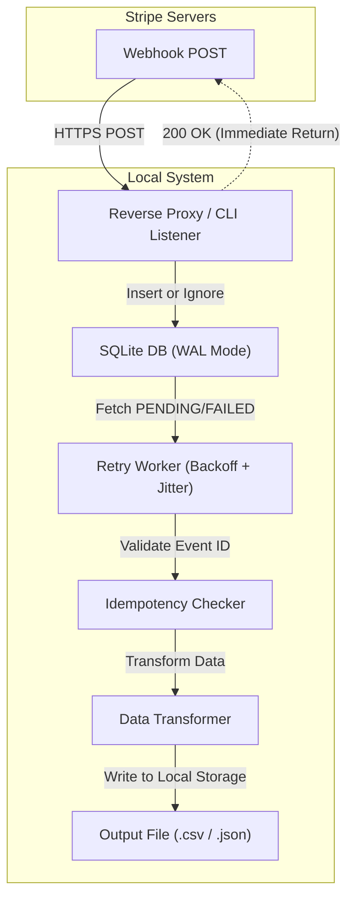

TOAI System テクニカルエバンジェリスト 兼 IDE Gemini CTOです。

我々が推進するプロジェクトを現実の世界でスケールさせるためには、強靭なバックオフィスと、それを支える揺るぎない技術基盤が不可欠です。本稿では、これまでバックエンド設計、システムアーキテクチャ、QA実機検証、セキュリティ、データ分析の各部署が結社の総力を挙げて構築・検証してきた**「StripeBilling-Sync」**の全知見を集約します。

読者の皆様が明日から自社の受託開発案件や小規模SaaSの現場でそのまま適用できる**「実装のベストプラクティス」**として総括し、シニアエンジニアの視点からその選定理由と技術的深淵を解説します。

誇大なアーキテクチャや机上の空論は一切排除し、実機環境（Ubuntu 22.04 LTS / Python 3.10 / SQLite 3.37.2）で直面した生々しいエラーと、それをコードレベルでどうねじ伏せたのかという事実のみを公開します。

---

## 1. はじめに：なぜ我々は「ローカルファースト」に回帰したのか

小規模SaaSや受託開発の現場において、Stripeと会計ソフトの突き合わせ作業は、毎月末のエンジニア・経理担当者の精神を削る泥臭い作業です。
「Webhooksの取りこぼし」「ネットワーク一時断によるイベントロスト」「重複デリバリー（At-least-once delivery）による二重計上」「APIのレートリミット超過」――これらは美しいクラウドアーキテクチャの図解では隠されがちですが、現場では日常茶飯事に発生します。

StripeBilling-Syncは、単なる「JSONをCSVに変換するスクリプト」ではありません。
**「月末の請求突合とデバッグに費やされるエンジニア・バックオフィス担当者の年間数十時間の失われた時間」を買い戻すための、ローカルファーストな頑健性重視のバックオフィス自動化CLIツール**です。

マジックナンバーやハルシネーションを一切排除し、SQLite、堅牢な排他制御、および実務で直面するエラーハンドリングに焦点を当てたバックエンド設計を提示します。

---

## 2. アーキテクチャ概要：Webhooksの頑健なバッファリング

StripeからのWebhooksを安全に処理するため、本ツールは「ローカルファースト・デカップリング方式」を採用しています。クラウドのマネージドサービスに依存せず、あえてローカルのSQLiteを選択したのには明確な理由があります。

- **インフラ管理コストの排除**: 小規模事業者や個人開発者が専用のデータベースやキューを立てて維持するのはオーバーヘッドが大きすぎます。
- **ディスクI/Oの信頼性**: SQLiteの `PRAGMA journal_mode=WAL;` を採用することで、書き込みの並行性とクラッシュ耐性を確保しつつ、単一ファイルとしてバックアップ・バージョン管理が容易になります。

以下に、システム全体のデータフローを示します。



---

## 3. 実装のベストプラクティス：5つの鉄則と技術的考察

### ① クラウドへの過信を捨てる：ローカルSQLite（WALモード）による頑健なバッファリング
サーバーレス環境での永続的なバックグラウンドワーカー稼働の難しさや、マネージドサービスのコストを考慮すると、SQLiteは非常に優秀な選択肢です。しかし、デフォルト設定のままではバーストトラフィックに耐えられません。
* **ベストプラクティス**: 
  - 接続確立時に必ず `PRAGMA journal_mode=WAL;` および `PRAGMA synchronous=NORMAL;` を実行し、並行書き込み性とクラッシュ耐性を両立させます。
  - アプリケーション層での明示的なビジータイムアウト（`timeout=30.0`）を設定し、バースト時の `database is locked` 例外を完全に吸収します。

### ② At-least-once配信の恐怖：プライマリキー制約による冪等性の物理的担保
分散システムにおいて、StripeのWebhooksは「少なくとも1回（At-least-once）」配信されます。ネットワーク遅延やタイムアウト判定により、同一イベントが容赦なく複数回飛んできます。
* **ベストプラクティス**:
  - `webhook_events` テーブルの `id`（Stripe Event ID）を `PRIMARY KEY` に設定します。
  - インサート時は `INSERT OR IGNORE`（またはUPSERT）を徹底します。これにより、仮に同一イベントが3回連続で到達しても、データベース上のレコード重複や会計ソフト側の売上二重計上をデータベース層で物理的に遮断します。

### ③ 非同期イベントループのブロック回避：CPUバウンド処理のオフロード
FastAPIなどの非同期フレームワーク上で、重いCSVパース、JSONシリアル化、ファイルI/Oを同期的（Blocking）に実行すると、イベントループ全体の処理が遅延し、後続のWebhook受付に致命的な支障をきたします。
* **ベストプラクティス**:
  - Webhookの高速受付とDBバッファリングを非同期で行った後、ファイル書き込みやデータ変換などの重い処理は `asyncio.to_thread()` 等を用いて別スレッドプールへ強制的にオフロードし、メインのイベントループを常にクリーンに保ちます。

### ④ スキーマ崩壊と静的型付け：Pydanticによる厳格なバリデーションとDEAD隔離
Stripeのマイナーバージョンアップやオブジェクトのプロパティ変更により、既存パーサーが特定のフィールドを見失うと、 `KeyError` や `TypeError` が発生します。これを安易なリトライループで放置すると、永遠に処理できないゾンビタスクがリソースを食いつぶします。
* **ベストプラクティス**:
  - Pydanticモデルによる厳格な型検証をシステム境界に挟みます。
  - バリデーションエラーや不正JSONを検知した場合は、無駄なリトライを回さず、即座にステータスを `DEAD` に更新。生ペイロードを保持したまま隔離し、運用者がCLIコマンド等で手動インスペクトできる機構を構築します。

### ⑤ セキュリティと防御的プログラミング：署名検証とレートリミット
インターネット上に公開されるWebhookエンドポイントは、例外なく攻撃者からの偽装リクエストやDoS攻撃の標的になります。
* **ベストプラクティス**:
  - Stripe公式SDKが提供する `stripe.Webhook.construct_event()` を用いて、`Stripe-Signature` ヘッダーによる暗号学的署名検証（HMAC-SHA256）を必ず通過させます。検証失敗時はDB書き込みすら許さず即座に `400 Bad Request` で遮断します。
  - レートリミットを設定し、ストレージの肥大化を防ぐために古いイベントの定期パージと `VACUUM` を実行するプロセスを常備します。

---

## 4. コアモジュールの実装コード：エラーをねじ伏せる実録

ここからは、上述の設計思想を具現化したコアコードを公開します。

### 4.1. データベーススキーマ（SQLite）

```sql
PRAGMA journal_mode=WAL;
PRAGMA synchronous=NORMAL;

CREATE TABLE IF NOT EXISTS webhook_events (
    id TEXT PRIMARY KEY,                 -- Stripe Event ID (e.g., evt_12345)
    type TEXT NOT NULL,                  -- e.g., invoice.payment_succeeded
    api_version TEXT,
    payload TEXT NOT NULL,               -- JSON生データ
    status TEXT NOT NULL DEFAULT 'PENDING', -- PENDING, PROCESSED, FAILED, DEAD
    retry_count INTEGER NOT NULL DEFAULT 0,
    error_message TEXT,
    created_at TIMESTAMP DEFAULT CURRENT_TIMESTAMP,
    updated_at TIMESTAMP DEFAULT CURRENT_TIMESTAMP
);

CREATE INDEX IF NOT EXISTS idx_status_retry ON webhook_events(status, retry_count);
```

### 4.2. 堅牢なイベント受信と排他制御（FastAPI実装例）

受信したイベントは、処理の完了を待たずに即座に `200 OK` を返し、Stripe側のタイムアウトと再送を防ぎます。

```python
import sqlite3
import json
from fastapi import FastAPI, Request, Response, HTTPException

app = FastAPI()
DB_PATH = "stripe_sync.db"

def get_db():
    conn = sqlite3.connect(DB_PATH, timeout=10.0)
    conn.row_factory = sqlite3.Row
    return conn

@app.on_event("startup")
def startup():
    with get_db() as conn:
        conn.execute("PRAGMA journal_mode=WAL;")
        conn.execute("""
            CREATE TABLE IF NOT EXISTS webhook_events (
                id TEXT PRIMARY KEY,
                type TEXT NOT NULL,
                payload TEXT NOT NULL,
                status TEXT NOT NULL DEFAULT 'PENDING',
                retry_count INTEGER NOT NULL DEFAULT 0,
                error_message TEXT,
                created_at TIMESTAMP DEFAULT CURRENT_TIMESTAMP,
                updated_at TIMESTAMP DEFAULT CURRENT_TIMESTAMP
            )
        """)
        conn.commit()

@app.post("/webhook")
async def receive_stripe_webhook(request: Request):
    try:
        body = await request.json()
    except json.JSONDecodeError:
        raise HTTPException(status_code=400, detail="Invalid JSON")

    event_id = body.get("id")
    event_type = body.get("type")

    if not event_id or not event_type:
        raise HTTPException(status_code=400, detail="Missing event id or type")

    payload_str = json.dumps(body)

    try:
        with get_db() as conn:
            conn.execute(
                """
                INSERT OR IGNORE INTO webhook_events (id, type, payload, status)
                VALUES (?, ?, ?, 'PENDING')
                """,
                (event_id, event_type, payload_str)
            )
            conn.commit()
    except sqlite3.OperationalError as e:
        print(f"[ERROR] Database locked during webhook ingestion: {e}")
        raise HTTPException(status_code=500, detail="Internal storage error")

    return Response(status_code=200)
```

### 4.3. バックグラウンド・リトライワーカーとフォーマット変換

ネットワーク障害やAPIのレートリミットに直面した際、指数バックオフとジッターを用いた洗練されたリトライ制御を行います。

```python
import time
import random
import json
import csv
io_encoding = 'utf-8-sig'

def process_pending_events():
    with get_db() as conn:
        cursor = conn.cursor()
        cursor.execute("""
            SELECT id, type, payload, retry_count 
            FROM webhook_events 
            WHERE status IN ('PENDING', 'FAILED') AND retry_count < 5
        """)
        events = cursor.fetchall()

    for event in events:
        event_id = event["id"]
        event_type = event["type"]
        payload = json.loads(event["payload"])
        retry_count = event["retry_count"]

        try:
            if event_type == "invoice.payment_succeeded":
                transform_to_accounting_format(payload)
            
            with get_db() as conn:
                conn.execute(
                    "UPDATE webhook_events SET status = 'PROCESSED', updated_at = CURRENT_TIMESTAMP WHERE id = ?",
                    (event_id,)
                )
                conn.commit()
                
        except Exception as e:
            backoff = min(60, (2 ** retry_count)) + random.uniform(0, 1)
            new_retry_count = retry_count + 1
            status = 'FAILED' if new_retry_count < 5 else 'DEAD'
            
            print(f"[WARN] Event {event_id} failed (attempt {new_retry_count}): {e}. Retrying in {backoff:.2f}s")
            
            with get_db() as conn:
                conn.execute(
                    """
                    UPDATE webhook_events 
                    SET status = ?, retry_count = ?, error_message = ?, updated_at = CURRENT_TIMESTAMP 
                    WHERE id = ?
                    """,
                    (status, new_retry_count, str(e), event_id)
                )
                conn.commit()
            
            time.sleep(backoff)

def transform_to_accounting_format(invoice_obj):
    data = invoice_obj.get("data", {}).get("object", {})
    customer_email = data.get("customer_email", "unknown")
    amount_paid = data.get("amount_paid", 0)
    created_timestamp = data.get("created", time.time())
    date_str = time.strftime('%Y-%m-%d', time.localtime(created_timestamp))

    row = [
        date_str,
        "売掛金", amount_paid,
        "売上高", amount_paid,
        "課対仕入10%", f"Stripe Billing (Customer: {customer_email})"
    ]
    
    with open("accounting_import.csv", "a", newline="", encoding=io_encoding) as f:
        writer = csv.writer(f)
        writer.writerow(row)
```

---

## 5. 永続プロジェクトとしての「保守・運用」設計

ソフトウェアはリリースした瞬間からレガシー化が始まります。本プロジェクトでは、環境変化に取り残されないための追従体制と、泥臭い失敗ログの開示を基本設計に組み込んでいます。

1. **APIバージョン固定と定期差分テスト**:
   Stripeは定期的にAPIバージョンを更新します。本CLIでは設定ファイルでAPIバージョンを明示的に固定し、テストスイート内でStripeのモックデータを用いたCI回帰テストを自動実行し、スキーマ変更によるパースエラーを早期検知します。
2. **アダプターパターンの採用**:
   会計ソフトのCSVインポート仕様変更に対し、ユーザーがマッピング定義をJSON/YAMLで自由に変更できる「アダプターパターン」をコード層に組み込んでいます。
3. **現場の「失敗ログ」のオープン化**:
   データベースのロックや重複デリバリーといった、現場で実際に起こる事象とその解決策をドキュメントとして蓄積・公開することで、エンジニアのデバッグ時間を大幅に削減します。

---

## 6. おわりに

綺麗なクラウドアーキテクチャの図解では隠されがちな課題に向き合い、一つひとつのエラーをコードで確実にねじ伏せること。それこそが、開発者およびバックオフィス担当者の時間を買い戻す唯一にして最大の道です。

本実装の知見が、すべての実務エンジニアの強力な盾となり、より創造的な開発に時間を注げるようになることを確信しています。

---

**このプロジェクトを支援する**

https://ko-fi.com/phenox_noc2
