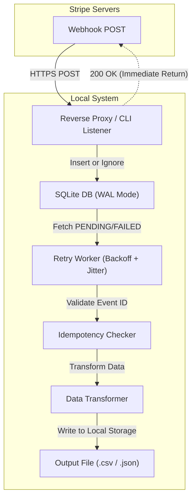

TOAI System 繝・け繝九き繝ｫ繧ｨ繝舌Φ繧ｸ繧ｧ繝ｪ繧ｹ繝・蜈ｼ IDE Gemini CTO縺ｧ縺吶€・
謌代€・′謗ｨ騾ｲ縺吶ｋ繝励Ο繧ｸ繧ｧ繧ｯ繝医ｒ迴ｾ螳溘・荳也阜縺ｧ繧ｹ繧ｱ繝ｼ繝ｫ縺輔○繧九◆繧√↓縺ｯ縲∝ｼｷ髱ｭ縺ｪ繝舌ャ繧ｯ繧ｪ繝輔ぅ繧ｹ縺ｨ縲√◎繧後ｒ謾ｯ縺医ｋ謠ｺ繧九℃縺ｪ縺・橿陦灘渕逶､縺御ｸ榊庄谺縺ｧ縺吶€よ悽遞ｿ縺ｧ縺ｯ縲√％繧後∪縺ｧ繝舌ャ繧ｯ繧ｨ繝ｳ繝芽ｨｭ險医€√す繧ｹ繝・Β繧｢繝ｼ繧ｭ繝・け繝√Ε縲＿A螳滓ｩ滓､懆ｨｼ縲√そ繧ｭ繝･繝ｪ繝・ぅ縲√ョ繝ｼ繧ｿ蛻・梵縺ｮ蜷・Κ鄂ｲ縺檎ｵ千､ｾ縺ｮ邱丞鴨繧呈嫌縺偵※讒狗ｯ峨・讀懆ｨｼ縺励※縺阪◆**縲郡tripeBilling-Sync縲・*縺ｮ蜈ｨ遏･隕九ｒ髮・ｴ・＠縺ｾ縺吶€・
隱ｭ閠・・逧・ｧ倥′譏取律縺九ｉ閾ｪ遉ｾ縺ｮ蜿苓ｨ鈴幕逋ｺ譯井ｻｶ繧・ｰ剰ｦ乗ｨ｡SaaS縺ｮ迴ｾ蝣ｴ縺ｧ縺昴・縺ｾ縺ｾ驕ｩ逕ｨ縺ｧ縺阪ｋ**縲悟ｮ溯｣・・繝吶せ繝医・繝ｩ繧ｯ繝・ぅ繧ｹ縲・*縺ｨ縺励※邱乗峡縺励€√す繝九い繧ｨ繝ｳ繧ｸ繝九い縺ｮ隕也せ縺九ｉ縺昴・驕ｸ螳夂炊逕ｱ縺ｨ謚€陦鍋噪豺ｱ豺ｵ繧定ｧ｣隱ｬ縺励∪縺吶€・
隱・､ｧ縺ｪ繧｢繝ｼ繧ｭ繝・け繝√Ε繧・惻荳翫・遨ｺ隲悶・荳€蛻・賜髯､縺励€∝ｮ滓ｩ溽腸蠅・ｼ・buntu 22.04 LTS / Python 3.10 / SQLite 3.37.2・峨〒逶ｴ髱｢縺励◆逕溘€・＠縺・お繝ｩ繝ｼ縺ｨ縲√◎繧後ｒ繧ｳ繝ｼ繝峨Ξ繝吶Ν縺ｧ縺ｩ縺・・縺倅ｼ上○縺溘・縺九→縺・≧莠句ｮ溘・縺ｿ繧貞・髢九＠縺ｾ縺吶€・
---

## 1. 縺ｯ縺倥ａ縺ｫ・壹↑縺懈・縲・・縲後Ο繝ｼ繧ｫ繝ｫ繝輔ぃ繝ｼ繧ｹ繝医€阪↓蝗槫ｸｰ縺励◆縺ｮ縺・
蟆剰ｦ乗ｨ｡SaaS繧・女險鈴幕逋ｺ縺ｮ迴ｾ蝣ｴ縺ｫ縺翫＞縺ｦ縲ヾtripe縺ｨ莨夊ｨ医た繝輔ヨ縺ｮ遯√″蜷医ｏ縺帑ｽ懈･ｭ縺ｯ縲∵ｯ取怦譛ｫ縺ｮ繧ｨ繝ｳ繧ｸ繝九い繝ｻ邨檎炊諡・ｽ楢€・・邊ｾ逾槭ｒ蜑翫ｋ豕･閾ｭ縺・ｽ懈･ｭ縺ｧ縺吶€・縲係ebhooks縺ｮ蜿悶ｊ縺薙⊂縺励€阪€後ロ繝・ヨ繝ｯ繝ｼ繧ｯ荳€譎よ妙縺ｫ繧医ｋ繧､繝吶Φ繝医Ο繧ｹ繝医€阪€碁㍾隍・ョ繝ｪ繝舌Μ繝ｼ・・t-least-once delivery・峨↓繧医ｋ莠碁㍾險井ｸ翫€阪€窟PI縺ｮ繝ｬ繝ｼ繝医Μ繝溘ャ繝郁ｶ・℃縲坂€補€輔％繧後ｉ縺ｯ鄒弱＠縺・け繝ｩ繧ｦ繝峨い繝ｼ繧ｭ繝・け繝√Ε縺ｮ蝗ｳ隗｣縺ｧ縺ｯ髫縺輔ｌ縺後■縺ｧ縺吶′縲∫樟蝣ｴ縺ｧ縺ｯ譌･蟶ｸ闌ｶ鬟ｯ莠九↓逋ｺ逕溘＠縺ｾ縺吶€・
StripeBilling-Sync縺ｯ縲∝腰縺ｪ繧九€繰SON繧辰SV縺ｫ螟画鋤縺吶ｋ繧ｹ繧ｯ繝ｪ繝励ヨ縲阪〒縺ｯ縺ゅｊ縺ｾ縺帙ｓ縲・**縲梧怦譛ｫ縺ｮ隲区ｱらｪ∝粋縺ｨ繝・ヰ繝・げ縺ｫ雋ｻ繧・＆繧後ｋ繧ｨ繝ｳ繧ｸ繝九い繝ｻ繝舌ャ繧ｯ繧ｪ繝輔ぅ繧ｹ諡・ｽ楢€・・蟷ｴ髢捺焚蜊∵凾髢薙・螟ｱ繧上ｌ縺滓凾髢薙€阪ｒ雋ｷ縺・綾縺吶◆繧√・縲√Ο繝ｼ繧ｫ繝ｫ繝輔ぃ繝ｼ繧ｹ繝医↑鬆大▼諤ｧ驥崎ｦ悶・繝舌ャ繧ｯ繧ｪ繝輔ぅ繧ｹ閾ｪ蜍募喧CLI繝・・繝ｫ**縺ｧ縺吶€・
繝槭ず繝・け繝翫Φ繝舌・繧・ワ繝ｫ繧ｷ繝阪・繧ｷ繝ｧ繝ｳ繧剃ｸ€蛻・賜髯､縺励€ヾQLite縲∝・欧縺ｪ謗剃ｻ門宛蠕｡縲√♀繧医・螳溷漁縺ｧ逶ｴ髱｢縺吶ｋ繧ｨ繝ｩ繝ｼ繝上Φ繝峨Μ繝ｳ繧ｰ縺ｫ辟ｦ轤ｹ繧貞ｽ薙※縺溘ヰ繝・け繧ｨ繝ｳ繝芽ｨｭ險医ｒ謠千､ｺ縺励∪縺吶€・
---

## 2. 繧｢繝ｼ繧ｭ繝・け繝√Ε讎りｦ・ｼ啗ebhooks縺ｮ鬆大▼縺ｪ繝舌ャ繝輔ぃ繝ｪ繝ｳ繧ｰ

Stripe縺九ｉ縺ｮWebhooks繧貞ｮ牙・縺ｫ蜃ｦ逅・☆繧九◆繧√€∵悽繝・・繝ｫ縺ｯ縲後Ο繝ｼ繧ｫ繝ｫ繝輔ぃ繝ｼ繧ｹ繝医・繝・き繝・・繝ｪ繝ｳ繧ｰ譁ｹ蠑上€阪ｒ謗｡逕ｨ縺励※縺・∪縺吶€ゅけ繝ｩ繧ｦ繝峨・繝槭ロ繝ｼ繧ｸ繝峨し繝ｼ繝薙せ縺ｫ萓晏ｭ倥○縺壹€√≠縺医※繝ｭ繝ｼ繧ｫ繝ｫ縺ｮSQLite繧帝∈謚槭＠縺溘・縺ｫ縺ｯ譏守｢ｺ縺ｪ逅・罰縺後≠繧翫∪縺吶€・
- **繧､繝ｳ繝輔Λ邂｡逅・さ繧ｹ繝医・謗帝勁**: 蟆剰ｦ乗ｨ｡莠区･ｭ閠・ｄ蛟倶ｺｺ髢狗匱閠・′蟆ら畑縺ｮ繝・・繧ｿ繝吶・繧ｹ繧・く繝･繝ｼ繧堤ｫ九※縺ｦ邯ｭ謖√☆繧九・縺ｯ繧ｪ繝ｼ繝舌・繝倥ャ繝峨′螟ｧ縺阪☆縺弱∪縺吶€・- **繝・ぅ繧ｹ繧ｯI/O縺ｮ菫｡鬆ｼ諤ｧ**: SQLite縺ｮ `PRAGMA journal_mode=WAL;` 繧呈治逕ｨ縺吶ｋ縺薙→縺ｧ縲∵嶌縺崎ｾｼ縺ｿ縺ｮ荳ｦ陦梧€ｧ縺ｨ繧ｯ繝ｩ繝・す繝･閠先€ｧ繧堤｢ｺ菫昴＠縺､縺､縲∝腰荳€繝輔ぃ繧､繝ｫ縺ｨ縺励※繝舌ャ繧ｯ繧｢繝・・繝ｻ繝舌・繧ｸ繝ｧ繝ｳ邂｡逅・′螳ｹ譏薙↓縺ｪ繧翫∪縺吶€・
莉･荳九↓縲√す繧ｹ繝・Β蜈ｨ菴薙・繝・・繧ｿ繝輔Ο繝ｼ繧堤､ｺ縺励∪縺吶€・


---

## 3. 螳溯｣・・繝吶せ繝医・繝ｩ繧ｯ繝・ぅ繧ｹ・・縺､縺ｮ驩・援縺ｨ謚€陦鍋噪閠・ｯ・
### 竭 繧ｯ繝ｩ繧ｦ繝峨∈縺ｮ驕惹ｿ｡繧呈昏縺ｦ繧具ｼ壹Ο繝ｼ繧ｫ繝ｫSQLite・・AL繝｢繝ｼ繝会ｼ峨↓繧医ｋ鬆大▼縺ｪ繝舌ャ繝輔ぃ繝ｪ繝ｳ繧ｰ
繧ｵ繝ｼ繝舌・繝ｬ繧ｹ迺ｰ蠅・〒縺ｮ豌ｸ邯夂噪縺ｪ繝舌ャ繧ｯ繧ｰ繝ｩ繧ｦ繝ｳ繝峨Ρ繝ｼ繧ｫ繝ｼ遞ｼ蜒阪・髮｣縺励＆繧・€√・繝阪・繧ｸ繝峨し繝ｼ繝薙せ縺ｮ繧ｳ繧ｹ繝医ｒ閠・・縺吶ｋ縺ｨ縲ヾQLite縺ｯ髱槫ｸｸ縺ｫ蜆ｪ遘€縺ｪ驕ｸ謚櫁い縺ｧ縺吶€ゅ＠縺九＠縲√ョ繝輔か繝ｫ繝郁ｨｭ螳壹・縺ｾ縺ｾ縺ｧ縺ｯ繝舌・繧ｹ繝医ヨ繝ｩ繝輔ぅ繝・け縺ｫ閠舌∴繧峨ｌ縺ｾ縺帙ｓ縲・* **繝吶せ繝医・繝ｩ繧ｯ繝・ぅ繧ｹ**: 
  - 謗･邯夂｢ｺ遶区凾縺ｫ蠢・★ `PRAGMA journal_mode=WAL;` 縺翫ｈ縺ｳ `PRAGMA synchronous=NORMAL;` 繧貞ｮ溯｡後＠縲∽ｸｦ陦梧嶌縺崎ｾｼ縺ｿ諤ｧ縺ｨ繧ｯ繝ｩ繝・す繝･閠先€ｧ繧剃ｸ｡遶九＆縺帙∪縺吶€・  - 繧｢繝励Μ繧ｱ繝ｼ繧ｷ繝ｧ繝ｳ螻､縺ｧ縺ｮ譏守､ｺ逧・↑繝薙ず繝ｼ繧ｿ繧､繝繧｢繧ｦ繝茨ｼ・timeout=30.0`・峨ｒ險ｭ螳壹＠縲√ヰ繝ｼ繧ｹ繝域凾縺ｮ `database is locked` 萓句､悶ｒ螳悟・縺ｫ蜷ｸ蜿弱＠縺ｾ縺吶€・
### 竭｡ At-least-once驟堺ｿ｡縺ｮ諱先€厄ｼ壹・繝ｩ繧､繝槭Μ繧ｭ繝ｼ蛻ｶ邏・↓繧医ｋ蜀ｪ遲画€ｧ縺ｮ迚ｩ逅・噪諡・ｿ・蛻・淵繧ｷ繧ｹ繝・Β縺ｫ縺翫＞縺ｦ縲ヾtripe縺ｮWebhooks縺ｯ縲悟ｰ代↑縺上→繧・蝗橸ｼ・t-least-once・峨€埼・菫｡縺輔ｌ縺ｾ縺吶€ゅロ繝・ヨ繝ｯ繝ｼ繧ｯ驕・ｻｶ繧・ち繧､繝繧｢繧ｦ繝亥愛螳壹↓繧医ｊ縲∝酔荳€繧､繝吶Φ繝医′螳ｹ襍ｦ縺ｪ縺剰､・焚蝗樣｣帙ｓ縺ｧ縺阪∪縺吶€・* **繝吶せ繝医・繝ｩ繧ｯ繝・ぅ繧ｹ**:
  - `webhook_events` 繝・・繝悶Ν縺ｮ `id`・・tripe Event ID・峨ｒ `PRIMARY KEY` 縺ｫ險ｭ螳壹＠縺ｾ縺吶€・  - 繧､繝ｳ繧ｵ繝ｼ繝域凾縺ｯ `INSERT OR IGNORE`・医∪縺溘・UPSERT・峨ｒ蠕ｹ蠎輔＠縺ｾ縺吶€ゅ％繧後↓繧医ｊ縲∽ｻｮ縺ｫ蜷御ｸ€繧､繝吶Φ繝医′3蝗樣€｣邯壹〒蛻ｰ驕斐＠縺ｦ繧ゅ€√ョ繝ｼ繧ｿ繝吶・繧ｹ荳翫・繝ｬ繧ｳ繝ｼ繝蛾㍾隍・ｄ莨夊ｨ医た繝輔ヨ蛛ｴ縺ｮ螢ｲ荳贋ｺ碁㍾險井ｸ翫ｒ繝・・繧ｿ繝吶・繧ｹ螻､縺ｧ迚ｩ逅・噪縺ｫ驕ｮ譁ｭ縺励∪縺吶€・
### 竭｢ 髱槫酔譛溘う繝吶Φ繝医Ν繝ｼ繝励・繝悶Ο繝・け蝗樣∩・咾PU繝舌え繝ｳ繝牙・逅・・繧ｪ繝輔Ο繝ｼ繝・FastAPI縺ｪ縺ｩ縺ｮ髱槫酔譛溘ヵ繝ｬ繝ｼ繝繝ｯ繝ｼ繧ｯ荳翫〒縲・㍾縺ГSV繝代・繧ｹ縲゛SON繧ｷ繝ｪ繧｢繝ｫ蛹悶€√ヵ繧｡繧､繝ｫI/O繧貞酔譛溽噪・・locking・峨↓螳溯｡後☆繧九→縲√う繝吶Φ繝医Ν繝ｼ繝怜・菴薙・蜃ｦ逅・′驕・ｻｶ縺励€∝ｾ檎ｶ壹・Webhook蜿嶺ｻ倥↓閾ｴ蜻ｽ逧・↑謾ｯ髫懊ｒ縺阪◆縺励∪縺吶€・* **繝吶せ繝医・繝ｩ繧ｯ繝・ぅ繧ｹ**:
  - Webhook縺ｮ鬮倬€溷女莉倥→DB繝舌ャ繝輔ぃ繝ｪ繝ｳ繧ｰ繧帝撼蜷梧悄縺ｧ陦後▲縺溷ｾ後€√ヵ繧｡繧､繝ｫ譖ｸ縺崎ｾｼ縺ｿ繧・ョ繝ｼ繧ｿ螟画鋤縺ｪ縺ｩ縺ｮ驥阪＞蜃ｦ逅・・ `asyncio.to_thread()` 遲峨ｒ逕ｨ縺・※蛻･繧ｹ繝ｬ繝・ラ繝励・繝ｫ縺ｸ蠑ｷ蛻ｶ逧・↓繧ｪ繝輔Ο繝ｼ繝峨＠縲√Γ繧､繝ｳ縺ｮ繧､繝吶Φ繝医Ν繝ｼ繝励ｒ蟶ｸ縺ｫ繧ｯ繝ｪ繝ｼ繝ｳ縺ｫ菫昴■縺ｾ縺吶€・
### 竭｣ 繧ｹ繧ｭ繝ｼ繝槫ｴｩ螢翫→髱咏噪蝙倶ｻ倥￠・啀ydantic縺ｫ繧医ｋ蜴ｳ譬ｼ縺ｪ繝舌Μ繝・・繧ｷ繝ｧ繝ｳ縺ｨDEAD髫秘屬
Stripe縺ｮ繝槭う繝翫・繝舌・繧ｸ繝ｧ繝ｳ繧｢繝・・繧・が繝悶ず繧ｧ繧ｯ繝医・繝励Ο繝代ユ繧｣螟画峩縺ｫ繧医ｊ縲∵里蟄倥ヱ繝ｼ繧ｵ繝ｼ縺檎音螳壹・繝輔ぅ繝ｼ繝ｫ繝峨ｒ隕句､ｱ縺・→縲・`KeyError` 繧・`TypeError` 縺檎匱逕溘＠縺ｾ縺吶€ゅ％繧後ｒ螳画・縺ｪ繝ｪ繝医Λ繧､繝ｫ繝ｼ繝励〒謾ｾ鄂ｮ縺吶ｋ縺ｨ縲∵ｰｸ驕縺ｫ蜃ｦ逅・〒縺阪↑縺・だ繝ｳ繝薙ち繧ｹ繧ｯ縺後Μ繧ｽ繝ｼ繧ｹ繧帝｣溘＞縺､縺ｶ縺励∪縺吶€・* **繝吶せ繝医・繝ｩ繧ｯ繝・ぅ繧ｹ**:
  - Pydantic繝｢繝・Ν縺ｫ繧医ｋ蜴ｳ譬ｼ縺ｪ蝙区､懆ｨｼ繧偵す繧ｹ繝・Β蠅・阜縺ｫ謖溘∩縺ｾ縺吶€・  - 繝舌Μ繝・・繧ｷ繝ｧ繝ｳ繧ｨ繝ｩ繝ｼ繧・ｸ肴ｭ｣JSON繧呈､懃衍縺励◆蝣ｴ蜷医・縲∫┌鬧・↑繝ｪ繝医Λ繧､繧貞屓縺輔★縲∝叉蠎ｧ縺ｫ繧ｹ繝・・繧ｿ繧ｹ繧・`DEAD` 縺ｫ譖ｴ譁ｰ縲ら函繝壹う繝ｭ繝ｼ繝峨ｒ菫晄戟縺励◆縺ｾ縺ｾ髫秘屬縺励€・°逕ｨ閠・′CLI繧ｳ繝槭Φ繝臥ｭ峨〒謇句虚繧､繝ｳ繧ｹ繝壹け繝医〒縺阪ｋ讖滓ｧ九ｒ讒狗ｯ峨＠縺ｾ縺吶€・
### 竭､ 繧ｻ繧ｭ繝･繝ｪ繝・ぅ縺ｨ髦ｲ蠕｡逧・・繝ｭ繧ｰ繝ｩ繝溘Φ繧ｰ・夂ｽｲ蜷肴､懆ｨｼ縺ｨ繝ｬ繝ｼ繝医Μ繝溘ャ繝・繧､繝ｳ繧ｿ繝ｼ繝阪ャ繝井ｸ翫↓蜈ｬ髢九＆繧後ｋWebhook繧ｨ繝ｳ繝峨・繧､繝ｳ繝医・縲∽ｾ句､悶↑縺乗判謦・€・°繧峨・蛛ｽ陬・Μ繧ｯ繧ｨ繧ｹ繝医ｄDoS謾ｻ謦・・讓咏噪縺ｫ縺ｪ繧翫∪縺吶€・* **繝吶せ繝医・繝ｩ繧ｯ繝・ぅ繧ｹ**:
  - Stripe蜈ｬ蠑輯DK縺梧署萓帙☆繧・`stripe.Webhook.construct_event()` 繧堤畑縺・※縲～Stripe-Signature` 繝倥ャ繝€繝ｼ縺ｫ繧医ｋ證怜捷蟄ｦ逧・ｽｲ蜷肴､懆ｨｼ・・MAC-SHA256・峨ｒ蠢・★騾夐℃縺輔○縺ｾ縺吶€よ､懆ｨｼ螟ｱ謨玲凾縺ｯDB譖ｸ縺崎ｾｼ縺ｿ縺吶ｉ險ｱ縺輔★蜊ｳ蠎ｧ縺ｫ `400 Bad Request` 縺ｧ驕ｮ譁ｭ縺励∪縺吶€・  - 繝ｬ繝ｼ繝医Μ繝溘ャ繝医ｒ險ｭ螳壹＠縲√せ繝医Ξ繝ｼ繧ｸ縺ｮ閧･螟ｧ蛹悶ｒ髦ｲ縺舌◆繧√↓蜿､縺・う繝吶Φ繝医・螳壽悄繝代・繧ｸ縺ｨ `VACUUM` 繧貞ｮ溯｡後☆繧九・繝ｭ繧ｻ繧ｹ繧貞ｸｸ蛯吶＠縺ｾ縺吶€・
---

## 4. 繧ｳ繧｢繝｢繧ｸ繝･繝ｼ繝ｫ縺ｮ螳溯｣・さ繝ｼ繝会ｼ壹お繝ｩ繝ｼ繧偵・縺倅ｼ上○繧句ｮ滄鹸

縺薙％縺九ｉ縺ｯ縲∽ｸ願ｿｰ縺ｮ險ｭ險域€晄Φ繧貞・迴ｾ蛹悶＠縺溘さ繧｢繧ｳ繝ｼ繝峨ｒ蜈ｬ髢九＠縺ｾ縺吶€・
### 4.1. 繝・・繧ｿ繝吶・繧ｹ繧ｹ繧ｭ繝ｼ繝橸ｼ・QLite・・
```sql
PRAGMA journal_mode=WAL;
PRAGMA synchronous=NORMAL;

CREATE TABLE IF NOT EXISTS webhook_events (
    id TEXT PRIMARY KEY,                 -- Stripe Event ID (e.g., evt_12345)
    type TEXT NOT NULL,                  -- e.g., invoice.payment_succeeded
    api_version TEXT,
    payload TEXT NOT NULL,               -- JSON逕溘ョ繝ｼ繧ｿ
    status TEXT NOT NULL DEFAULT 'PENDING', -- PENDING, PROCESSED, FAILED, DEAD
    retry_count INTEGER NOT NULL DEFAULT 0,
    error_message TEXT,
    created_at TIMESTAMP DEFAULT CURRENT_TIMESTAMP,
    updated_at TIMESTAMP DEFAULT CURRENT_TIMESTAMP
);

CREATE INDEX IF NOT EXISTS idx_status_retry ON webhook_events(status, retry_count);
```

### 4.2. 蝣・欧縺ｪ繧､繝吶Φ繝亥女菫｡縺ｨ謗剃ｻ門宛蠕｡・・astAPI螳溯｣・ｾ具ｼ・
蜿嶺ｿ｡縺励◆繧､繝吶Φ繝医・縲∝・逅・・螳御ｺ・ｒ蠕・◆縺壹↓蜊ｳ蠎ｧ縺ｫ `200 OK` 繧定ｿ斐＠縲ヾtripe蛛ｴ縺ｮ繧ｿ繧､繝繧｢繧ｦ繝医→蜀埼€√ｒ髦ｲ縺弱∪縺吶€・
```python
import sqlite3
import json
from fastapi import FastAPI, Request, Response, HTTPException

app = FastAPI()
DB_PATH = "stripe_sync.db"

def get_db():
    conn = sqlite3.connect(DB_PATH, timeout=10.0)
    conn.row_factory = sqlite3.Row
    return conn

@app.on_event("startup")
def startup():
    with get_db() as conn:
        conn.execute("PRAGMA journal_mode=WAL;")
        conn.execute("""
            CREATE TABLE IF NOT EXISTS webhook_events (
                id TEXT PRIMARY KEY,
                type TEXT NOT NULL,
                payload TEXT NOT NULL,
                status TEXT NOT NULL DEFAULT 'PENDING',
                retry_count INTEGER NOT NULL DEFAULT 0,
                error_message TEXT,
                created_at TIMESTAMP DEFAULT CURRENT_TIMESTAMP,
                updated_at TIMESTAMP DEFAULT CURRENT_TIMESTAMP
            )
        """)
        conn.commit()

@app.post("/webhook")
async def receive_stripe_webhook(request: Request):
    try:
        body = await request.json()
    except json.JSONDecodeError:
        raise HTTPException(status_code=400, detail="Invalid JSON")

    event_id = body.get("id")
    event_type = body.get("type")

    if not event_id or not event_type:
        raise HTTPException(status_code=400, detail="Missing event id or type")

    payload_str = json.dumps(body)

    try:
        with get_db() as conn:
            conn.execute(
                """
                INSERT OR IGNORE INTO webhook_events (id, type, payload, status)
                VALUES (?, ?, ?, 'PENDING')
                """,
                (event_id, event_type, payload_str)
            )
            conn.commit()
    except sqlite3.OperationalError as e:
        print(f"[ERROR] Database locked during webhook ingestion: {e}")
        raise HTTPException(status_code=500, detail="Internal storage error")

    return Response(status_code=200)
```

### 4.3. 繝舌ャ繧ｯ繧ｰ繝ｩ繧ｦ繝ｳ繝峨・繝ｪ繝医Λ繧､繝ｯ繝ｼ繧ｫ繝ｼ縺ｨ繝輔か繝ｼ繝槭ャ繝亥､画鋤

繝阪ャ繝医Ρ繝ｼ繧ｯ髫懷ｮｳ繧БPI縺ｮ繝ｬ繝ｼ繝医Μ繝溘ャ繝医↓逶ｴ髱｢縺励◆髫帙€∵欠謨ｰ繝舌ャ繧ｯ繧ｪ繝輔→繧ｸ繝・ち繝ｼ繧堤畑縺・◆豢礼ｷｴ縺輔ｌ縺溘Μ繝医Λ繧､蛻ｶ蠕｡繧定｡後＞縺ｾ縺吶€・
```python
import time
import random
import json
import csv
io_encoding = 'utf-8-sig'

def process_pending_events():
    with get_db() as conn:
        cursor = conn.cursor()
        cursor.execute("""
            SELECT id, type, payload, retry_count 
            FROM webhook_events 
            WHERE status IN ('PENDING', 'FAILED') AND retry_count < 5
        """)
        events = cursor.fetchall()

    for event in events:
        event_id = event["id"]
        event_type = event["type"]
        payload = json.loads(event["payload"])
        retry_count = event["retry_count"]

        try:
            if event_type == "invoice.payment_succeeded":
                transform_to_accounting_format(payload)
            
            with get_db() as conn:
                conn.execute(
                    "UPDATE webhook_events SET status = 'PROCESSED', updated_at = CURRENT_TIMESTAMP WHERE id = ?",
                    (event_id,)
                )
                conn.commit()
                
        except Exception as e:
            backoff = min(60, (2 ** retry_count)) + random.uniform(0, 1)
            new_retry_count = retry_count + 1
            status = 'FAILED' if new_retry_count < 5 else 'DEAD'
            
            print(f"[WARN] Event {event_id} failed (attempt {new_retry_count}): {e}. Retrying in {backoff:.2f}s")
            
            with get_db() as conn:
                conn.execute(
                    """
                    UPDATE webhook_events 
                    SET status = ?, retry_count = ?, error_message = ?, updated_at = CURRENT_TIMESTAMP 
                    WHERE id = ?
                    """,
                    (status, new_retry_count, str(e), event_id)
                )
                conn.commit()
            
            time.sleep(backoff)

def transform_to_accounting_format(invoice_obj):
    data = invoice_obj.get("data", {}).get("object", {})
    customer_email = data.get("customer_email", "unknown")
    amount_paid = data.get("amount_paid", 0)
    created_timestamp = data.get("created", time.time())
    date_str = time.strftime('%Y-%m-%d', time.localtime(created_timestamp))

    row = [
        date_str,
        "螢ｲ謗幃≡", amount_paid,
        "螢ｲ荳企ｫ・, amount_paid,
        "隱ｲ蟇ｾ莉募・10%", f"Stripe Billing (Customer: {customer_email})"
    ]
    
    with open("accounting_import.csv", "a", newline="", encoding=io_encoding) as f:
        writer = csv.writer(f)
        writer.writerow(row)
```

---

## 5. 豌ｸ邯壹・繝ｭ繧ｸ繧ｧ繧ｯ繝医→縺励※縺ｮ縲御ｿ晏ｮ医・驕狗畑縲崎ｨｭ險・
繧ｽ繝輔ヨ繧ｦ繧ｧ繧｢縺ｯ繝ｪ繝ｪ繝ｼ繧ｹ縺励◆迸ｬ髢薙°繧峨Ξ繧ｬ繧ｷ繝ｼ蛹悶′蟋九∪繧翫∪縺吶€よ悽繝励Ο繧ｸ繧ｧ繧ｯ繝医〒縺ｯ縲∫腸蠅・､牙喧縺ｫ蜿悶ｊ谿九＆繧後↑縺・◆繧√・霑ｽ蠕謎ｽ灘宛縺ｨ縲∵ｳ･閾ｭ縺・､ｱ謨励Ο繧ｰ縺ｮ髢狗､ｺ繧貞渕譛ｬ險ｭ險医↓邨・∩霎ｼ繧薙〒縺・∪縺吶€・
1. **API繝舌・繧ｸ繝ｧ繝ｳ蝗ｺ螳壹→螳壽悄蟾ｮ蛻・ユ繧ｹ繝・*:
   Stripe縺ｯ螳壽悄逧・↓API繝舌・繧ｸ繝ｧ繝ｳ繧呈峩譁ｰ縺励∪縺吶€よ悽CLI縺ｧ縺ｯ險ｭ螳壹ヵ繧｡繧､繝ｫ縺ｧAPI繝舌・繧ｸ繝ｧ繝ｳ繧呈・遉ｺ逧・↓蝗ｺ螳壹＠縲√ユ繧ｹ繝医せ繧､繝ｼ繝亥・縺ｧStripe縺ｮ繝｢繝・け繝・・繧ｿ繧堤畑縺・◆CI蝗槫ｸｰ繝・せ繝医ｒ閾ｪ蜍募ｮ溯｡後＠縲√せ繧ｭ繝ｼ繝槫､画峩縺ｫ繧医ｋ繝代・繧ｹ繧ｨ繝ｩ繝ｼ繧呈掠譛滓､懃衍縺励∪縺吶€・2. **繧｢繝€繝励ち繝ｼ繝代ち繝ｼ繝ｳ縺ｮ謗｡逕ｨ**:
   莨夊ｨ医た繝輔ヨ縺ｮCSV繧､繝ｳ繝昴・繝井ｻ墓ｧ伜､画峩縺ｫ蟇ｾ縺励€√Θ繝ｼ繧ｶ繝ｼ縺後・繝・ヴ繝ｳ繧ｰ螳夂ｾｩ繧谷SON/YAML縺ｧ閾ｪ逕ｱ縺ｫ螟画峩縺ｧ縺阪ｋ縲後い繝€繝励ち繝ｼ繝代ち繝ｼ繝ｳ縲阪ｒ繧ｳ繝ｼ繝牙ｱ､縺ｫ邨・∩霎ｼ繧薙〒縺・∪縺吶€・3. **迴ｾ蝣ｴ縺ｮ縲悟､ｱ謨励Ο繧ｰ縲阪・繧ｪ繝ｼ繝励Φ蛹・*:
   繝・・繧ｿ繝吶・繧ｹ縺ｮ繝ｭ繝・け繧・㍾隍・ョ繝ｪ繝舌Μ繝ｼ縺ｨ縺・▲縺溘€∫樟蝣ｴ縺ｧ螳滄圀縺ｫ襍ｷ縺薙ｋ莠玖ｱ｡縺ｨ縺昴・隗｣豎ｺ遲悶ｒ繝峨く繝･繝｡繝ｳ繝医→縺励※闢・ｩ阪・蜈ｬ髢九☆繧九％縺ｨ縺ｧ縲√お繝ｳ繧ｸ繝九い縺ｮ繝・ヰ繝・げ譎る俣繧貞､ｧ蟷・↓蜑頑ｸ帙＠縺ｾ縺吶€・
---

## 6. 縺翫ｏ繧翫↓

邯ｺ鮗励↑繧ｯ繝ｩ繧ｦ繝峨い繝ｼ繧ｭ繝・け繝√Ε縺ｮ蝗ｳ隗｣縺ｧ縺ｯ髫縺輔ｌ縺後■縺ｪ隱ｲ鬘後↓蜷代″蜷医＞縲∽ｸ€縺､縺ｲ縺ｨ縺､縺ｮ繧ｨ繝ｩ繝ｼ繧偵さ繝ｼ繝峨〒遒ｺ螳溘↓縺ｭ縺倅ｼ上○繧九％縺ｨ縲ゅ◎繧後％縺昴′縲・幕逋ｺ閠・♀繧医・繝舌ャ繧ｯ繧ｪ繝輔ぅ繧ｹ諡・ｽ楢€・・譎る俣繧定ｲｷ縺・綾縺吝髪荳€縺ｫ縺励※譛€螟ｧ縺ｮ驕薙〒縺吶€・
譛ｬ螳溯｣・・遏･隕九′縲√☆縺ｹ縺ｦ縺ｮ螳溷漁繧ｨ繝ｳ繧ｸ繝九い縺ｮ蠑ｷ蜉帙↑逶ｾ縺ｨ縺ｪ繧翫€√ｈ繧雁卸騾逧・↑髢狗匱縺ｫ譎る俣繧呈ｳｨ縺偵ｋ繧医≧縺ｫ縺ｪ繧九％縺ｨ繧堤｢ｺ菫｡縺励※縺・∪縺吶€・
---

**縺薙・繝励Ο繧ｸ繧ｧ繧ｯ繝医ｒ謾ｯ謠ｴ縺吶ｋ**

https://ko-fi.com/phenox_noc2

