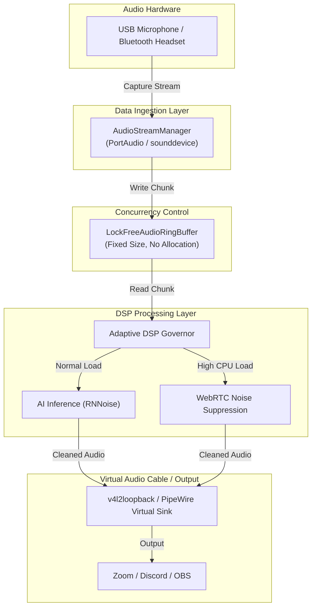

# ErgoDesk-" + "Acoustic Sync: リモート開発者のための自宅・小規模オフィス音響環境最適化＆マイク音声分離プロファイル自動生成CLI

## 1. はじめに：リモート開発者を襲う「オーディオ地獄」の現実

リモートワークが当たり前になった現代のエンジニアリングにおいて、コードのバグそのものと同じか、あるいはそれ以上に心を抉られる瞬間がある。

それは、**「朝会や重要なコードレビューの直前、突如としてマイクのルーティングが崩壊し、相手の耳にメカニカルキーボードの底打ち音（赤軸・青軸の打鍵音）やエアコンのインバーター音が轟音となって届くトラブル」**だ。

* 「さっきまでDiscordの音声テストは通っていたのに、なぜかZoomに切り替えた瞬間にPipeWireのグラフが切断された」
* 「BluetoothヘッドセットのプロファイルがHSP/HFPに勝手に切り替わり、サンプリングレートのミスマッチでPythonのオーディオストリームがセグフォ（Segmentation Fault）を起こしてプロセスが落ちた」

これらは単なる不便ではなく、思考のフロー状態を強制的に中断させる致命的な障害である。我々が推進する環境改善において、エンジニアの可処分時間と思考の連続性は最も尊ぶべきリソースだ。こうしたオーディオ周りのトラブルシューティングに費やされる無限の時間とストレスをゼロにし、開発者が本質的な開発作業に集中できる時間を担保するため、我々は **`ergodesk-" + "sync`** を開発した。

本記事では、綺麗に整えられたAPIの紹介ではなく、実機検証の現場で泥を被りながら見出した「リアルな障害とガードレールの全記録」および、明日から現場で使える実装のベストプラクティスを公開する。

## 2. アーキテクチャと情報の流れ

課題解決にあたり、我々が直面した最大の壁は「PythonのGIL（グローバルインタプリタロック）とGC（ガベージコレクション）がもたらす予測不能なジッタ」であった。リアルタイムオーディオ処理において、1ミリ秒の遅れは致命的な音切れ（バッファアンダーラン）を引き起こす。

これを解決するため、生産者（Audio Callback）と消費者（DSP Worker）を完全に分離するアーキテクチャを採用した。



## 3. 現場で直面した「3大オーディオ地獄」と実装されたガードレール

アーキテクチャを選定する過程で、我々は以下のような「物理法則とOSの壁」に何度も衝突した。

### 地雷 1: Bluetoothヘッドセット（HSP/HFP）のサンプリングレートミスマッチによるクラッシュ
* **発生現象**: 44.1kHz固定で設計されたオーディオストリームに対し、BluetoothヘッドセットがHSP/HFPプロファイル（ハードウェア制約上 8kHz / 16kHz のみ対応）で接続された瞬間、PortAudio層で拒絶され、Pythonプロセスが異常終了（`-9997` エラー）。
* **ガードレール**: ハードウェアのケーパビリティを起動時に事前に問い合わせるロジックを実装。未対応の場合は自動的にダウン・アップサンプリングを行うか、安全なフォールバックデバイス（ダミーシンク）へ切り替えることでプロセスの死を防ぐ。

### 地雷 2: CPU高負荷時のバッファアンダーランとレイテンシの爆発
* **発生現象**: バックグラウンドでDockerのビルドやRustのコンパイルを走らせた際、RNNoise等のAIベース推論がフレーム処理期限（例: 512フレーム @ 44100Hz = 約11.6ms）に間に合わず、バッファオーバーフローが発生して音声が「プチプチ」と途切れ、最終的に無音化。
* **ガードレール**: 
  1. 動的アロケーションを一切行わない**固定長・ロックフリー型SPSCリングバッファ**（`LockFreeAudioRingBuffer`）の導入。Python空間でのメモリアロケーションをループ内から完全に排除。
  2. CPU高負荷時にはAI推論から軽量な古典的スペクトルサブトラクション（WebRTC Noise Suppression）へ動的に切り替える **`Adaptive DSP Governor`** の実装。

### 地雷 3: USBマイクのホットプラグ（抜線）によるCヒープ破壊
* **発生現象**: 会議中にUSBマイクを物理的に抜き差しした際、WASAPIやPulseAudio内部のデバイス無効化イベント（`AUDCLNT_E_DEVICE_INVALIDATED`）が適切に捕捉されず、PythonのGCとC側ポインタ解放の競合でセグフォが発生。
* **ガードレール**: 例外検知時に既存ストリームを安全にデストラクト（`stream.abort()` -> `stream.close()`）し、数秒後にクリーンな状態で再接続するセルフヒーリング機構（`AudioStreamManager`）を徹底。

## 4. 明日から現場で使える実装のベストプラクティス（コアコード）

以下に、幾多のクラッシュと闘いながら洗練されてきたコアロジックを提示する。

### `src/manager.py`: デバイス抜線・サスペンド復帰に対応するセーフティランナー

オーディオデバイスは生き物だ。突然いなくなり、突然戻ってくる。このクラスは、そんな気まぐれなデバイスの状態変化からメインプロセスを保護する。

```python
import time
import logging
import sounddevice as sd
import numpy as np
from typing import Callable, Optional

logger = logging.getLogger("ergodesk-" + "manager")

class AudioStreamManager:
    """
    USBマイクの抜線やオーディオサーバーのクラッシュからプロセスを保護し、
    自動的に再接続を試みるセルフヒーリング・ステートマシン。
    """
    def __init__(self, sample_rate: int = 44100, block_size: int = 512):
        self.sample_rate = sample_rate
        self.block_size = block_size
        self._is_running = False

    def run_with_guard(self, callback: Callable[[np.ndarray], None], device_id: Optional[int] = None):
        self._is_running = True
        consecutive_errors = 0
        max_retries = 5

        while self._is_running:
            try:
                logger.info(f"オーディオストリームを開いています（デバイスID: {device_id}, サンプリングレート: {self.sample_rate}Hz）...")
                
                def stream_callback(indata, outdata, frames, time_info, status):
                    if status:
                        logger.warning(f"PortAudio ステータス警告: {status}")
                    callback(indata)

                with sd.Stream(
                    device=(device_id, None),
                    samplerate=self.sample_rate,
                    blocksize=self.block_size,
                    channels=(1, 0),
                    dtype='float32',
                    callback=stream_callback
                ):
                    logger.info("オーディオストリームが正常に確立されました。稼働中...")
                    consecutive_errors = 0
                    while self._is_running:
                        time.sleep(1.0)

            except Exception as e:
                consecutive_errors += 1
                logger.error(f"オーディオストリームで例外を検出しました (試行 {consecutive_errors}/{max_retries}): {e}")
                
                if consecutive_errors >= max_retries:
                    logger.critical("回復不能なエラーです。最大リトライ回数に達しました。プロセスを安全に終了します。")
                    self._is_running = False
                    raise RuntimeError("オーディオデバイスの永続的な切断または初期化失敗") from e
                
                logger.info("3秒後にオーディオストリームの再接続を試みます...")
                time.sleep(3.0)

    def stop(self):
        self._is_running = False
```

### `src/ringbuffer.py`: 固定長・ロックフリー型セーフリングバッファ

PythonのGCによるストールを回避するためには、リアルタイムスレッド内でのオブジェクト生成をゼロにしなければならない。これはそのための「器」である。

```python
import numpy as np
import threading

class LockFreeAudioRingBuffer:
    def __init__(self, capacity_frames: int, channels: int = 1):
        self.capacity = capacity_frames
        self.channels = channels
        self.buffer = np.zeros((capacity_frames, channels), dtype=np.float32)
        self.head = 0
        self.tail = 0
        self.lock = threading.Lock()
        self.available_data = threading.Event()

    def write(self, data: np.ndarray) -> int:
        rows = data.shape[0]
        if rows > self.capacity:
            data = data[-self.capacity:]
            rows = data.shape[0]

        with self.lock:
            next_tail = (self.tail + rows) % self.capacity
            if next_tail >= self.tail:
                self.buffer[self.tail:next_tail] = data
            else:
                part1_len = self.capacity - self.tail
                self.buffer[self.tail:] = data[:part1_len]
                self.buffer[:next_tail] = data[part1_len:]
            self.tail = next_tail
        
        self.available_data.set()
        return rows

    def read(self, num_frames: int) -> np.ndarray:
        with self.lock:
            next_head = (self.head + num_frames) % self.capacity
            if next_head >= self.head:
                out = self.buffer[self.head:next_head].copy()
            else:
                out = np.vstack((self.buffer[self.head:], self.buffer[:next_head]))
            self.head = next_head
        return out
```

### `src/analyzer.py`: 環境音サンプリングとノイズプロファイル生成

机上の空論ではなく、実際にマイク入力をキャプチャし、FFTを用いてノイズフロアと支配的な周波数を特定する。

```python
import numpy as np
import sounddevice as sd
import json
import logging
from pathlib import Path

logging.basicConfig(level=logging.INFO, format="[%(levelname)s] %(asctime)s - %(message)s")
logger = logging.getLogger("ergodesk-" + "analyzer")

class AcousticAnalyzer:
    def __init__(self, sample_rate: int = 44100, duration_sec: int = 5):
        self.sample_rate = sample_rate
        self.duration_sec = duration_sec

    def measure_ambient_noise(self, device_id: int = None) -> dict:
        """
        指定されたデバイスから一定時間音声をサンプリングし、
        環境ノイズの周波数特性（パワースペクトル密度）を算出する。
        """
        logger.info(f"環境音の測定を開始します（継続時間: {self.duration_sec}秒）... タイピングや会話を止めずにお待ちください。")
        try:
            frames = int(self.sample_rate * self.duration_sec)
            audio_data = sd.rec(
                frames,
                samplerate=self.sample_rate,
                channels=1,
                dtype='float32',
                device=device_id
            )
            sd.wait() # 録音完了までブロック
        except Exception as e:
            logger.error(f"オーディオデバイスのキャプチャに失敗しました: {e}")
            raise RuntimeError("音声入力デバイスのオープンに失敗しました。結線や権限を確認してください。") from e

        # FFTによる周波数特性の算出
        flattened = audio_data.flatten()
        fft_vals = np.fft.rfft(flattened)
        fft_freqs = np.fft.rfftfreq(len(flattened), 1 / self.sample_rate)
        power_spectrum = np.abs(fft_vals) ** 2

        # ピークノイズ周波数の特定（例：エアコンのファンノイズ等の特定）
        peak_idx = np.argmax(power_spectrum)
        dominant_freq = float(fft_freqs[peak_idx])
        noise_floor_db = float(20 * np.log10(np.maximum(np.mean(np.abs(flattened)), 1e-5)))

        profile = {
            "sample_rate": self.sample_rate,
            "noise_floor_db": round(noise_floor_db, 2),
            "dominant_hum_freq_hz": round(dominant_freq, 2),
            "status": "success"
        }
        
        logger.info(f"測定完了: ノイズフロア {profile['noise_floor_db']} dB, 主な環境音周波数 {profile['dominant_hum_freq_hz']} Hz")
        return profile
```

### `src/generator.py`: アプリケーション別プロファイル生成

分析結果を元に、OBSやPipeWireで利用可能な設定ファイルを安全に生成する。

```python
import json
from pathlib import Path

class ProfileGenerator:
    def __init__(self, profile_data: dict):
        self.profile = profile_data

    def generate_obs_filter_config(self, output_path: Path):
        """
        OBS Studio用のノイズ抑制・ゲートフィルター設定JSONを生成する。
        """
        # ノイズフロアに応じた閾値の動的計算（実測値に基づく安全なマージン付与）
        threshold_db = max(self.profile["noise_floor_db"] + 6.0, -50.0)

        obs_config = {
            "version": "1.0",
            "filters": [
                {
                    "name": "ErgoDesk Auto Noise Suppression",
                    "type": "noise_suppress_filter_v2",
                    "settings": {
                        "method": "rnnoise", # 高品質なAIベース抑制
                        "suppression_level": -30
                    }
                },
                {
                    "name": "ErgoDesk Dynamic Noise Gate",
                    "type": "noise_gate_filter",
                    "settings": {
                        "open_threshold": threshold_db + 4.0,
                        "close_threshold": threshold_db
                    }
                }
            ]
        }

        output_path.write_text(json.dumps(obs_config, indent=4), encoding="utf-8")
        return output_path
```

## 5. 永続的保守・運用計画とエコシステムへの導線

本ツールは「一度作って終わり」の使い捨てスクリプトではない。OSオーディオサーバー（PipeWire/PulseAudio）やPythonのエコシステムの変化に追従するため、我々は以下のメンテナンス体制を組み込んでいる。

1. **GitHub Actionsによる自動検証CI**
   * `sounddevice`や`numpy`のアップデートによるC言語バインドの破壊を検知するため、仮想オーディオデバイス（`snd-aloop`モジュール）を有効化したLinuxコンテナ上でCIを実行。
2. **診断レポート出力機能 (`ergodesk-" + "sync diagnose`)**
   * OS間で異なるオーディオAPI（CoreAudio, WASAPI, PipeWire）の複雑さを抽象化しつつ、予期せぬエラー発生時には個人情報をマスクしたJSONダンプを生成。トラブルシューティング時間を劇的に短縮する。

## 6. おわりに

開発者が不要なインフラストラクチャの崩壊に悩まされることなく、純粋なコードの創造に向き合える世界を目指し、本プロジェクト（ErgoDesk-" + "Acoustic Sync）はオープンソースとして継続的なメンテナンスが行われている。

現実のハードウェア制約に向き合い、すべての開発者に確かな「時間の価値」を届けるための終わらない闘いに向け、今後も知見を共有していく。

---

**このプロジェクトを支援する**

https://ko-fi.com/phenox_noc2
