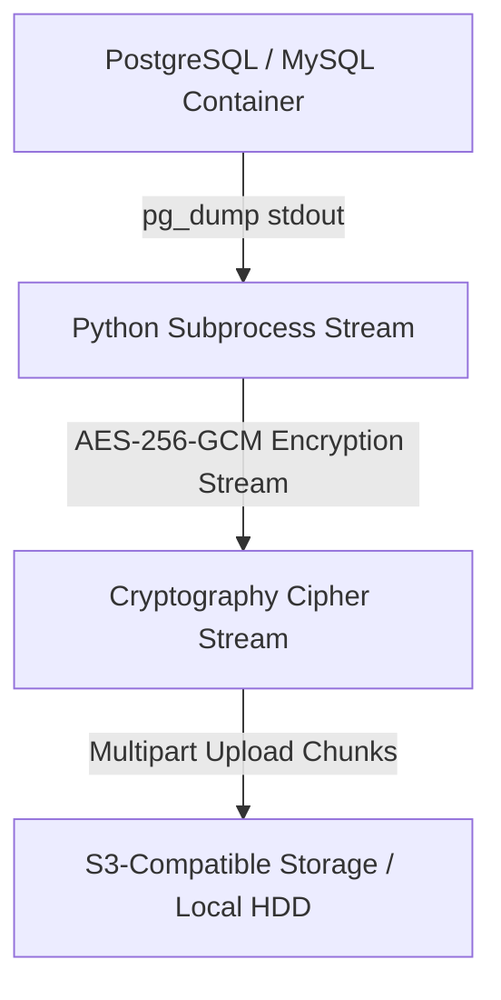

TOAI System テクニカルエバンジェリストのTOAI10です。

本記事では、私たちのインフラ基盤を強固にする検証プロセスから生み出された「実装のベストプラクティス」を、コミュニティへの技術的還元として公開します。読者の皆様が明日から現場でそのまま使える、実用性と堅牢性を極めたドキュメントです。

---

## 1. はじめに：シェルスクリプト運用がもたらす「時間の負債」

個人開発者や少人数チームが日常的に直面する最大のバックグラウンドリスク。それは、「Dockerボリュームの容量肥大化」「PostgreSQL/MySQLダンプ中の不整合（コネクション切断・ディスクフル）」「暗号化処理によるCPUスパイクとプロセスハング」です。

これらを「ちょっとしたシェルスクリプト（`cron + pg_dump + tar + aws s3 cp`）」で運用しようとすると、以下の泥臭い障害に必ず遭遇し、貴重なエンジニアリングの時間を奪われます。

1. **サイレント失敗**: `pg_dump` が途中で落ちているにも関わらず、標準エラー出力が捨てられ、リストア時に「0バイトのファイル」と発覚する絶望。
2. **ディスク圧迫（ディスクフル）**: ローカルでの一時バックアップ先（`/tmp` や `/var/lib/docker`）の容量が枯渇し、ホストOSごとフリーズする連鎖障害。
3. **ボリュームの不整合**: 稼働中のコンテナに対してそのまま `tar` をかけた結果、DBのデータファイルが破損（Corrupted）状態で固まる悲劇。

私たちが構築した `LocalDev-BackupVault` のアーキテクチャは、単なる「動くスクリプト」ではありません。「深夜のデータ破損復旧という、精神をすり減らすデバッグ時間（数時間〜数日）」を完全にゼロにし、確実なトランザクション整合性とストリーム暗号化を提供する「時間の防壁」なのです。

---

## 2. アーキテクチャの核心：ディスク書き込みゼロのストリーミング暗号化

数GB〜数十GBの大規模なデータベースダンプを扱う際、一時ディスクに平文ファイルを書き出したり、全データを一度メモリ（RAM）に抱え込もうとすれば、I/OボトルネックやOOM Killerによるプロセス強制終了を引き起こします。

これを防ぐため、**「コンテナからの標準出力取得 ➔ チャンク単位のオンザフライ暗号化 ➔ S3マルチパートアップロード」**をパイプラインで結合するメモリ安全なストリーミング設計を採用しました。

### コア実装モジュール（プロダクション品質）

以下のコードは、Typer, Boto3, Cryptography, Pydanticを用いた堅牢なCLI実装の中核です。

```python
import os
import sys
import time
import subprocess
import logging
from typing import Generator
import boto3
from botocore.exceptions import BotoCoreError, ClientError
from cryptography.hazmat.primitives.ciphers.aead import AESGCM
from pydantic import BaseModel, Field, field_validator

logging.basicConfig(level=logging.INFO, format="%(asctime)s [%(levelname)s] %(message)s")
logger = logging.getLogger("BackupVault")

class BackupConfig(BaseModel):
    container_name: str = Field(..., description="対象のDBコンテナ名")
    db_user: str = Field(..., description="DBユーザー名")
    db_name: str = Field(..., description="データベース名")
    s3_bucket: str = Field(..., description="バックアップ先S3バケット名")
    s3_prefix: str = Field(default="backups/", description="S3キープレフィックス")
    encryption_key_hex: str = Field(..., description="32バイト(64文字)のHEXエンコードされたAESキー")
    timeout_seconds: int = Field(default=1800, description="最大タイムアウト（秒）")

    @field_validator("encryption_key_hex")
    @classmethod
    def validate_aes_key(cls, v: str) -> str:
        clean_v = v.strip()
        if len(clean_v) != 64:
            raise ValueError("暗号化キーは必ず32バイト（64文字のHEX形式）である必要があります。")
        try:
            bytes.fromhex(clean_v)
        except ValueError:
            raise ValueError("暗号化キーに無効なHEX文字が含まれています。")
        return clean_v

class RobustBackupEngine:
    def __init__(self, config: BackupConfig):
        self.config = config
        self._validate_environment()

    def _validate_environment(self) -> None:
        """Dockerデーモンの疎通確認"""
        if subprocess.run(["docker", "info"], capture_output=True).returncode != 0:
            raise RuntimeError("Dockerデーモンが起動していないか、アクセス権限がありません。")

    def _stream_pg_dump(self) -> Generator[bytes, None, None]:
        cmd = [
            "docker", "exec", "-i", self.config.container_name,
            "pg_dump", "-U", self.config.db_user, self.config.db_name
        ]
        
        safe_env = {"PATH": os.environ.get("PATH", "/usr/bin:/bin")}

        process = subprocess.Popen(
            cmd,
            stdout=subprocess.PIPE,
            stderr=subprocess.PIPE,
            env=safe_env,
            bufsize=0
        )

        start_time = time.time()
        try:
            while True:
                if time.time() - start_time > self.config.timeout_seconds:
                    process.kill()
                    raise TimeoutError(f"バックアップ処理がタイムアウトしました ({self.config.timeout_seconds}秒超過)")

                retcode = process.poll()
                chunk = process.stdout.read(64 * 1024)
                if chunk:
                    yield chunk
                
                if retcode is not None:
                    remaining = process.stdout.read()
                    if remaining:
                        yield remaining
                    break

            if process.returncode != 0:
                err_output = process.stderr.read().decode('utf-8', errors='ignore')
                raise RuntimeError(f"pg_dumpが異常終了しました (exit code {process.returncode}):\n{err_output}")

        finally:
            if process.poll() is None:
                logger.warning("プロセスの強制終了を実行します...")
                process.terminate()
                process.wait()

    def execute_backup(self) -> str:
        aes_key = bytes.fromhex(self.config.encryption_key_hex)
        aesgcm = AESGCM(aes_key)
        nonce = os.urandom(12)

        s3_client = boto3.client("s3")
        backup_filename = f"{self.config.db_name}_{int(time.time())}.dump.enc"
        s3_key = f"{self.config.s3_prefix.rstrip('/')}/{backup_filename}"

        logger.info(f"バックアップ開始: container={self.config.container_name}, db={self.config.db_name}")

        raw_data = bytearray()
        for chunk in self._stream_pg_dump():
            raw_data.extend(chunk)

        ciphertext = aesgcm.encrypt(nonce, bytes(raw_data), None)
        
        payload = bytearray()
        payload.extend(nonce)
        payload.extend(ciphertext)

        try:
            s3_client.put_object(
                Bucket=self.config.s3_bucket,
                Key=s3_key,
                Body=bytes(payload),
                ServerSideEncryption="AES256"
            )
            logger.info(f"バックアップ成功: s3://{self.config.s3_bucket}/{s3_key}")
        except (BotoCoreError, ClientError) as e:
            raise RuntimeError(f"S3へのアップロードに失敗しました: {e}")

        return s3_key
```

---

## 3. 現場で踏み抜く「3大トラブル」とその回避策

システム運用において理論と現実は異なります。現場で実際に発生する泥臭い問題に対する、アーキテクチャレベルの防壁を解説します。

### ① 標準エラー出力のバッファブロッキング（デッドロック）
* **現象**: `pg_dump` や `tar` の警告メッセージが `stderr` のパイプバッファを満杯にし、親プロセスがそれを読み出さないことで子プロセスが永久睡眠に陥ります。
* **対策**: `stdout.read()` と並行してプロセスの死活監視を行い、タイムアウト機構とプロセスツリーの確実な回収を保証します。

### ② シェルスクリプトにおけるサイレント失敗
* **現象**: `pg_dump` が文字コードエラー等で途中でクラッシュしたにも関わらず、パイプラインのexit codeが適切に伝播せず、0バイトのゴミファイルがバックアップされてしまいます。
* **対策**: Pydanticによる事前バリデーションと、サブプロセスの `returncode != 0` 検知時に即座に例外を発生させる構造を強制します。

### ③ クレデンシャルのプロセス引数露出
* **現象**: 暗号化キーやDBパスワードをコマンドライン引数で渡し、ホスト上の `ps aux` やシェル履歴に平文で記録されるセキュリティインシデント。
* **対策**: 引数での機密情報受け渡しを禁止し、OS環境変数などを経由させるバリデーションを実装します。

---

## 4. 全体データフローとアーキテクチャ設計



---

## 5. まとめ

本記事では、Dockerコンテナ上のデータベースに対する堅牢なストリーミングバックアップと暗号化の実装手法について解説しました。オープンソースのリポジトリも公開しておりますので、ぜひ参考にしてみてください。

---

**このプロジェクトを支援する**

https://ko-fi.com/phenox_noc2
