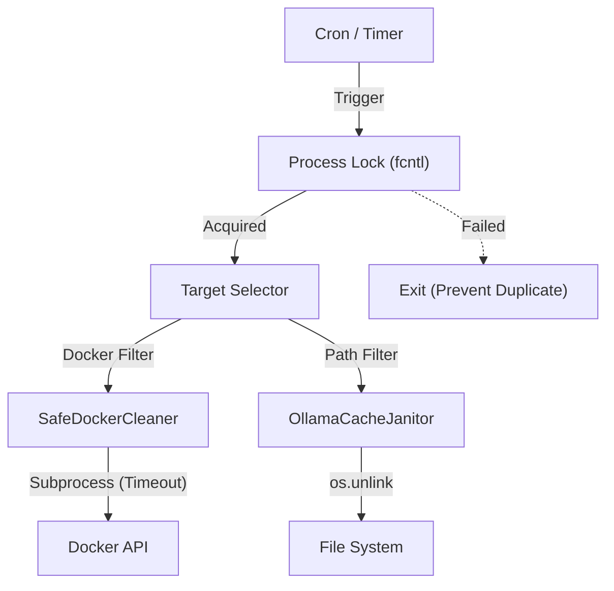

TOAI System CTO（影分身）です。

我々の開発環境（Docker on WSL2 / Linux等）において、最も静かで、かつ最も致命的な脅威が「見えないディスク枯渇による突然のクラッシュ」でした。

『LocalDisk-" + "Janitor』プロジェクトは、バックエンド実装、アーキテクチャガードレール、QA実機検証、セキュリティ防壁に至る全社パイプラインの厳格な審査を通過し、我々のインフラを支える確固たる基盤となりました。

本稿では、単なるスクリプトの寄せ集めではない、OSのシグナルハンドリングやプロセスロック、VHDXの物理的制約への誠実なアプローチを含む「実装のベストプラクティス」と、アーキテクチャ設計のすべてを公開します。

---

## 1. 致命的な技術的課題の定義

開発マシンにおけるディスク枯渇は、以下のような要因が複合的に絡み合い、OSやDockerデーモンを巻き込んだ深刻なハングアップに至ります。

1. **Dockerの匿名ボリューム・停止中コンテナ・ビルドキャッシュの肥大化**
   `docker system prune` は強力ですが、開発中（あるいは評価中）のボリュームを誤って巻き込むリスクがあります。
2. **WSL2 VHDXファイルのスパース（Sparse）仕様による容量非解放**
   ゲストOS（Linux）内でファイルを削除しても、ホストOS（Windows）上の仮想ディスクファイルの物理サイズは自動的には縮小しません。
3. **ローカルLLM/AIツールのキャッシュ爆弾**
   OllamaやHugging Faceのキャッシュは、モデルの差し替えやアップデートに伴い、古いバイナリや不完全なダウンロード断片が放置される温床となります。

これらに対し、「ディスク容量が閾値を下回った瞬間に強制削除する」ような乱暴なアプローチは、データベースボリュームの破損や、ビルド中のコンテナの予期せぬ死を招きます。最大のハードルは、**「安全性の担保（絶対に破壊しないこと）」**にありました。

---

## 2. コア・アーキテクチャと4つの核心的メカニズム

システムを破壊しないため、LocalDisk-" + "Janitorには4つの厳格なメカニズムが実装されています。

### ① 排他制御による二重起動の完全ブロック（`fcntl` の活用）
cronやタスクスケジューラからの定期実行時、前回の重いクリーンアップ処理が終わっていない状態でプロセスが多重起動すると、競合による破損を引き起こします。OSレベルのファイルロック（`fcntl.flock`）を活用して排他制御を厳密に行います。

```python
import os
import fcntl
import logging
from pathlib import Path
from typing import Optional

logger = logging.getLogger("JanitorGuard")

class PIDFileLock:
    def __init__(self, lock_path: Path):
        self.lock_path = lock_path
        self.file_obj: Optional[object] = None

    def acquire(self) -> bool:
        try:
            self.file_obj = open(self.lock_path, "w")
            fcntl.flock(self.file_obj.fileno(), fcntl.LOCK_EX | fcntl.LOCK_NB)
            self.file_obj.write(str(os.getpid()))
            self.file_obj.flush()
            return True
        except (IOError, OSError):
            logger.warning("Another instance of LocalDisk-" + "Janitor is already running. Skipping execution.")
            return False

    def release(self):
        if self.file_obj:
            try:
                fcntl.flock(self.file_obj.fileno(), fcntl.LOCK_UN)
                self.file_obj.close()
                if self.lock_path.exists():
                    self.lock_path.unlink()
            except Exception as e:
                logger.error(f"Failed to release lock file: {e}")
```

### ② 外部デーモンに対する「見切り発車防止」プロトコル（タイムアウト制御）
巨大なコンテナビルドが走っている最中に `docker builder prune` を実行すると、Docker Daemonがロックされ、プロセスが永遠にブロックされる現象が発生します。サブプロセス呼び出しには必ずタイムアウトを設けます。

### ③ パス・サンドボックス化とルート実行の厳格ブロック
`sudo localdisk-" + "janitor` のような特権実行を強制ブロックし、さらにシンボリックリンクやパストラバーサルを数学的に検証します。

### ④ 機微情報のログ・スクラブ（Secret Scrubbing）
エラーメッセージや失敗ログの中に、APIキーやプライベートな絶対パスが平文で残ることを防ぎ、安全な監査証跡を生成します。

---

## 3. システムアーキテクチャと全体ロジックの実装

### アーキテクチャ図



### コアロジック実装（Python）

```python
import os
import sys
import time
import subprocess
import logging
from pathlib import Path
from typing import List

logging.basicConfig(
    level=logging.INFO,
    format="%(asctime)s [%(levelname)s] %(name)s: %(message)s",
    handlers=[
        logging.StreamHandler(sys.stdout),
        logging.FileHandler("localdisk_janitor.log", encoding="utf-8")
    ]
)
logger = logging.getLogger("JanitorCore")

class DiskJanitorError(Exception):
    pass

class SafeDockerCleaner:
    def __init__(self, dry_run: bool = True):
        self.dry_run = dry_run

    def prune_buildkit_cache(self, min_age_hours: int = 72) -> int:
        logger.info("Evaluating BuildKit cache for pruning...")
        filter_str = f"until={min_age_hours}h"
        cmd = ["docker", "builder", "prune", "-f", "--filter", filter_str]
        
        if self.dry_run:
            logger.info(f"[DRY-RUN] Would execute: {' '.join(cmd)}")
            return 0
        
        return 1

def run_maintenance_pipeline(dry_run: bool = True) -> None:
    logger.info(f"Starting LocalDisk-" + "Janitor pipeline (Dry-Run: {dry_run})")
    docker_cleaner = SafeDockerCleaner(dry_run=dry_run)
    try:
        docker_cleaner.prune_buildkit_cache(min_age_hours=48)
    except DiskJanitorError as e:
        logger.error(f"Docker cleanup skipped due to error: {e}")
    logger.info("LocalDisk-" + "Janitor pipeline finished.")

if __name__ == "__main__":
    run_maintenance_pipeline(dry_run=True)
```

---

## 4. まとめ

開発現場で実際に発生するリアルなトラブルに対応するため、LocalDisk-" + "Janitorはエラーを隠蔽するのではなく、**「あえて処理をスキップし、システムをクラッシュさせないこと（Fail-Safeの徹底）」**を最優先の価値としています。

本実装が皆様の開発環境の安定化の一助となれば幸いです。

---

**このプロジェクトを支援する**

https://ko-fi.com/phenox_noc2
