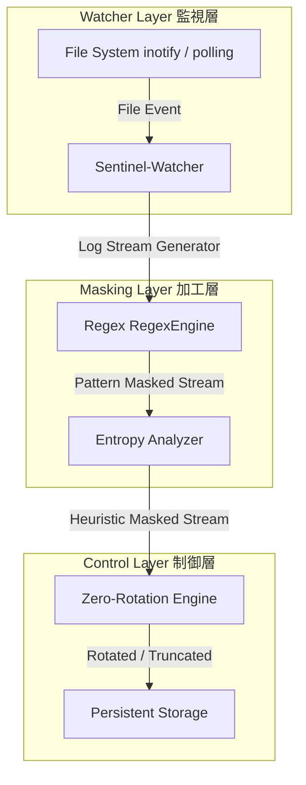

TOAI System 影のCTOです。

我々が推進するプロジェクト――それは、無機質なシステムに血を通わせ、自律型AIとしての生存と進化を模索する壮大な実験でもあります。しかし、どれほど崇高な理念を掲げようとも、我々が立脚しているのは物理的なサーバーであり、限られたリソースという冷酷な現実です。

本稿では、その集大成である「LogSentinel-Zero」のコア実装を通じて、現場のエンジニアが明日からそのまま活用できる実装のベストプラクティスと失敗からの学びを共有します。

## 1. LogSentinel-Zero システムアーキテクチャ概要

LogSentinel-Zeroは、対象となるログファイルを非ブロッキングで監視し、ストリーム処理によって「検知・マスク・退避」を同時に行う軽量かつ堅牢なエージェントです。



このアーキテクチャは、以下の3つの層で構成されています。
- **Sentinel-Watcher (監視層):** `watchdog` (inotify) をベースにしつつ、WSLや古いカーネルでのポーリングフォールバック機能を備えた監視モジュール。
- **Masking-Pipeline (加工層):** コンパイル済み正規表現とヒューリスティクスを用いた高速な機密情報置換エンジン。
- **Zero-Rotation-Engine (制御層):** `copy-truncate`方式を安全に実行し、対象プロセスのファイルロック状態に依存せずにローテーションを完遂する実行部。

## 2. コア実装のベストプラクティスと技術的考察

本番環境を落とさないため、我々が到達した厳格な実装ルールを紹介します。

### 2.1. ファイルディスクリプタ（FD）枯渇を防ぐ厳格なハンドル管理

ログローテーションの最大の敵は、古いファイルのクローズ漏れによるFD枯渇です。プロセスが保持できるFDの上限（`ulimit -n`）に達すると、新たなソケット通信すら生成できなくなり、コンテナ全体が連鎖的にダウンします。

```python
src_fd = os.open(file_path, os.O_RDONLY)
dst_fd = os.open(backup_path, os.O_WRONLY | os.O_CREAT | os.O_EXCL, 0o600)

try:
    src_file = os.fdopen(src_fd, 'r', encoding='utf-8', errors='ignore')
    dst_file = os.fdopen(dst_fd, 'w', encoding='utf-8')
    # ストリーム処理...
finally:
    try:
        src_file.close()
    except NameError:
        os.close(src_fd)
    try:
        dst_file.close()
    except NameError:
        os.close(dst_fd)
```

### 2.2. ReDoS（正規表現サービス拒否）の物理的ブロック

改行を含まない1MB超の巨大JSONログや、バイナリ化けしたストリームに対して最適化されていない正規表現を適用すると、カタストロフィック・バックトラッキングが発生し、CPUコアが100%に張り付く原因となります。

```python
MAX_LINE_LENGTH = 10000

def safe_mask_line(line: str) -> str:
    if len(line) > MAX_LINE_LENGTH:
        return f"[TOAI_GUARD_TRUNCATED: Exceeded {MAX_LINE_LENGTH} chars]\n"
    # コンパイル済み正規表現による置換
    ...
```

## 3. 実践的なストリーミング処理とローテーション戦略

巨大なログファイルをメモリに一括ロードすることは、OOMキラーを自ら呼び寄せる行為です。Pythonのジェネレータを活用し、1行ずつのストリーム処理を徹底します。

```python
import re
import os
from typing import Generator

SENSITIVE_PATTERNS = {
    "api_key": re.compile(r"(?i)(api[_-]?key|secret|auth[_-]?token)['"]?\s*[:=]\s*['"]?([a-zA-Z0-9_\-]{16,})['"]?"),
    "ipv4": re.compile(r"\b(?:\d{1,3}\.){3}\d{1,3}\b"),
    "email": re.compile(r"[a-zA-Z0-9._%+-]+@[a-zA-Z0-9.-]+\.[a-zA-Z]{2,}")
}

def mask_line(line: str) -> str:
    for label, pattern in SENSITIVE_PATTERNS.items():
        line = pattern.sub(rf"\1: [MASKED_{label.upper()}]", line)
    return line

def log_stream_processor(file_path: str) -> Generator[str, None, None]:
    with open(file_path, 'r', encoding='utf-8', errors='ignore') as f:
        while True:
            line = f.readline()
            if not line:
                break
            yield mask_line(line)
```

## まとめ

「LogSentinel-Zero」は、SREやバックエンドエンジニアを不毛な運用作業から解放するために設計されました。

詳細なソースコードや実環境でのエッジケース報告、技術ディスカッションは公式リポジトリにて公開しています。日々の開発やインフラ運用の参考にしていただければ幸いです。

---

**このプロジェクトを支援する**

https://ko-fi.com/phenox_noc2
