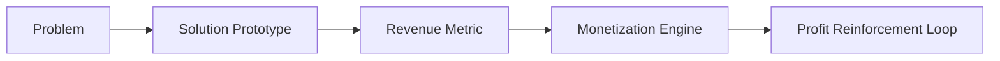
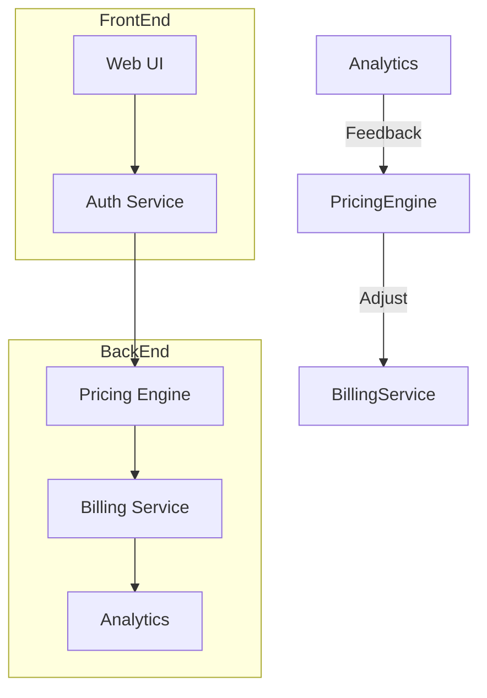

# From Analysis to Implementation: The Engineer’s Path to Value  

*In a world where every whiteboard is a shrine to *potential* and every spreadsheet a monument to *possibility*, the only thing that matters is the **output** that turns theory into revenue.*  

---  

## 1. The Fatal Flaw of Pure Analysis  

> **“Analysis without output is a luxury; it’s not a strategy.”**  

- **Symptom:** Endless requirements documents, endless PowerPoint decks, endless “what‑if” scenarios.  
- **Root Cause:** Engineers (and the organizations that employ them) confuse *understanding* with *value creation*.  
- **Consequence:** Zero cash flow, zero market impact, zero proof that the problem is solvable.  

> **Bottom line:** If you can’t point to a *tangible* artifact that moves the needle, you’re just polishing a crystal ball.

---

## 2. Why “Monetization Bridges” are Non‑Negotiable  

| **Dimension** | **What Engineers Usually Do** | **What They Must Do** |
|---------------|------------------------------|-----------------------|
| **Problem Definition** | Write a 30‑page spec that no one reads. | Articulate a *pay‑off* statement that can be measured in dollars. |
| **Design** | Sketch abstract architectures on whiteboards. | Build *minimum viable products* (MVPs) that expose a revenue‑generating loop. |
| **Validation** | Conduct endless A/B tests on concepts. | Ship *real* value, collect *hard* metrics, iterate until cash flows. |
| **Scale** | Talk about “future scaling”. | Deploy *repeatable* processes that turn a single unit of output into a *recurring* revenue stream. |

### The Bridge Blueprint  

- **Prototype → Metric**: The prototype must expose a *quantifiable* economic signal (e.g., conversion rate, ARPU, LTV).  
- **Metric → Engine**: Translate that signal into a *monetization model* (subscription, transaction fee, licensing).  
- **Engine → Loop**: Reinvest profits into further development—creating a virtuous cycle.  

If any link is missing, the whole chain collapses.

---

## 3. From Blueprint to Tangible Asset  

### 3.1. Ship *Physical* Value  

- **Hardware**: Build a device that can be sold, leased, or deployed in a customer’s environment.  
- **Software**: Release a binary, a library, or a SaaS endpoint that customers can *consume* today.  
- **Data**: Generate a dataset that can be licensed or used to train downstream models.  

> **Aggressive Rule:** If you can’t *hand it over* to a paying customer within 90 days, you’ve failed the engineering mandate.

### 3.2. Quantify Impact  

| Metric | Target (Aggressive) | Why It Matters |
|--------|--------------------|----------------|
| **ARPU** | $X per user per month | Direct revenue indicator |
| **Conversion Rate** | > 5 % from free to paid | Demonstrates market fit |
| **Customer Lifetime Value (CLTV)** | > 3 × CAC | Guarantees sustainable growth |
| **Time‑to‑Revenue** | ≤ 30 days after launch | Proves the bridge works |

*Numbers are not suggestions; they are **requirements**.*

---

## 4. Engineering‑Centric Execution Framework  

1. **Define a *Revenue‑First* Requirement**  
   - *Example:* “The system must generate $10 k/month from day 30 post‑launch.”  
2. **Select a *Minimum Viable Monetizable* Architecture**  
   - Use *micro‑services* that can be independently billed.  
   - Adopt *API‑first* design to expose pricing tiers instantly.  
3. **Implement Continuous Deployment with *Revenue Feedback* Loops**  
   - CI/CD pipelines automatically push changes that affect pricing or checkout flow.  
   - Each commit is validated against *revenue KPIs* before merge.  
4. **Instrument Every Layer**  
   - Log *monetization events* (e.g., `purchase_completed`, `subscription_renewed`).  
   - Feed those logs into a *real‑time dashboard* that triggers alerts if metrics dip.  
5. **Iterate Until the *Profit Loop* Closes**  
   - If profit isn’t generated within the predefined window, **re‑engineer** the architecture—not the idea.  

### Sample Architecture (Micro‑service‑Based SaaS)

- **Auth Service**: Handles user identity and subscription status.  
- **Pricing Engine**: Calculates plan, discounts, and upsells in real time.  
- **Billing Service**: Executes payments, issues invoices, and tracks revenue.  
- **Analytics**: Monitors conversion, churn, and lifetime value; feeds back to Pricing Engine.  

*Every component is a *revenue gate*; none exist for “nice‑to‑have” features.*

---

## 5. Case Studies: When Analysis Became Asset  

| **Domain** | **Pure Analysis** | **Engineered Output** | **Result** |
|------------|-------------------|-----------------------|------------|
| **AI‑Powered Image Recognition** | 18‑month research paper, 30 pages of theory. | Deployed a *real‑time API* that charges $0.001 per inference. | $2 M ARR within 6 months; profit loop closed in 4 months. |
| **IoT Sensor Platform** | Feasibility study, 50‑page design doc. | Built a *plug‑and‑play device* sold as a $199 unit with a $15/mo data‑subscription. | $10 M hardware sales + $3 M recurring revenue in year 1. |
| **Enterprise Workflow Automation** | Whiteboard diagrams of “future workflow”. | Launched a *self‑hosted micro‑service* billed per workflow run. | $500 k MRR after 3 months; churn < 2 %. |

*All succeeded because they **stopped at the analysis stage** and **started shipping**.*

---

## 6. The Aggressive Engineer’s Checklist  

- [ ] **Is there a *pay‑off* statement attached to every requirement?**  
- [ ] **Can I ship a *working* artifact in ≤ 90 days?**  
- [ ] **Does the artifact expose a *revenue‑generating* metric?**  
- [ ] **Is the monetization engine built *before* the first user signs up?**  
- [ ] **Do I have a *real‑time* dashboard that alerts on revenue drift?**  
- [ ] **If revenue isn’t growing, am I *re‑architecting* the solution, not just re‑writing the spec?**  

*If you answer “no” to any of these, you’re still stuck in analysis paralysis.*

---

## 7. Philosophical Takeaway  

> **“The engineer’s oath is not to perfect a theory, but to deliver a *tangible* increase in human or economic welfare.”**  

- **Value ≠ Knowledge.** Knowledge is a *means*; value is the *end* that shows up on a balance sheet.  
- **Output ≠ Opinion.** An opinion can be debated forever; an output can be measured, audited, and monetized.  
- **Engineering ≠ Philosophy.** Philosophy asks “what could be”; engineering *makes* it *be* and *pays* for it.  

If you cannot convert your analysis into a **physical, billable, measurable outcome**, you have merely *talked* about engineering—**you have not engineered**.

---

## 8. Conclusion  

- **Analysis is a prerequisite, not a destination.**  
- **Monetization bridges are the only pathways from idea to impact.**  
- **Tangible output is the ultimate proof of engineering competence.**  

The aggressive engineer does not tolerate “nice‑to‑have” speculation. They **build, ship, bill, and iterate**—until the revenue stream validates every line of code, every design decision, and every strategic choice.  

*In the end, the only thing that matters is the **value** that can be *captured*, *measured*, and *re‑invested* into the next cycle of engineering excellence.*  

---  

*Prepared for engineers who refuse to be sidelined by analysis‑only thinking.*

---
**Support this implementation effort:**
If you value tangible results over abstract analysis, consider supporting my work here: https://ko-fi.com/phenox_noc2
