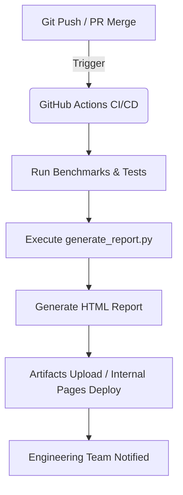

# 【TOAI8】PhenoX-AI-Allianceの内部自動レポートシステムが刷新：コミット `391bab5` の技術的背景と意義

こんにちは。PhenoX-AI-Alliance 開発チームです。

2026年8月2日、当社のフラグシップAIプラットフォームである **TOAI8**（`PhenoX-AI-Alliance/TOAI_System`）において、重大なアップデートが行われました。対象となったのはコミット **`391bab5`**。「内部自動レポート機能（Internal Report）」の新規追加です。

本記事では、この新しい自動レポートシステムがどのような技術的背景のもとで構築され、AIオペレーション（AIOps）にどのような変革をもたらすのかを解説します。

---

## 1. 背景：高度化するTOAI8と「ブラックボックス化」の課題

TOAI8は、大規模なマルチモーダル処理や強化学習エージェントの統合を進める中で、システムの複雑性が急激に高まっていました。

* **モデルの挙動の追跡困難さ**: 多数のサブモデルが協調動作するため、どのコンポーネントがボトルネックになっているかの即時把握が難しい。
* **ドキュメント生成のコスト**: 開発スピードを落とさないためには、実験結果やシステムメトリクスのドキュメント化を自動化する必要がある。
* **チーム間の情報共有**: AI研究者とインフラエンジニアの間で、現在のシステム状態や評価指標（Metrics）をリアルタイムかつ共通のフォーマットで共有する基盤が求められていた。

こうした課題を解決するため、CI/CDパイプラインと深く統合された**完全自動の内部レポート生成システム**が設計・実装されました。

---

## 2. コミット `391bab5` による新機能の概要

今回追加された内部レポート機能は、主に以下のコンポーネントで構成されています。

```text
PhenoX-AI-Alliance/TOAI_System/
 ┣ .github/workflows/       # CI/CD パイプライン定義
 ┣ scripts/
 ┃  ┗ generate_report.py    # レポート自動生成スクリプト（NEW）
 ┣ reports/
 ┃  ┗ internal/             # 生成されたHTMLレポートの出力先（NEW）
 └── ...
```

### ① データの収集と集約
バックグラウンドで稼働するモニタリングエージェントとテストスイートが、以下のデータを収集します。
* モデルの推論レイテンシおよびスループット
* リソース消費量（GPUメモリ、CPU、ネットワーク帯域）
* 自動テストおよびベンチマークのスコア履歴

### ② HTMLレポートへの動的レンダリング
収集されたJSON形式のメトリクスは、`scripts/generate_report.py` を通じて、スタイリッシュでインタラクティブなHTMLファイルへと変換されます。Tailwind CSSベースのデザインシステムを採用し、開発者がモバイルやデスクトップから一目でシステムの健全性を把握できるようになっています。

---

## 3. 自動CI/CDとHTMLレポートがもたらすAIOpsの効率化

今回の実装の最大の特徴は、**「開発フローへの完全なシームレス統合」**です。



1. **ゼロ・オーバーヘッド**: 開発者が手動でレポートを書く必要は一切ありません。コードがマージされるたび、あるいは日次のCronジョブによって自動で最新のレポートが生成されます。
2. **静的HTMLによるポータビリティ**: 複雑なダッシュボードツール（Grafana等）への常時接続を強いるのではなく、軽量なHTMLファイルとして出力されるため、アーカイブが容易であり、セキュリティ上のファイアウォール内でも安全に共有できます。
3. **継続的なAI改善（Continuous AI Reporting）**: 過去のレポートと比較することで、「どのコミットが推論速度を劣化させたか」「どのモデルの精度が向上したか」のトレンド分析が容易になりました。

---

## 4. 今後の展望

TOAI8におけるコミット `391bab5` の導入は、単なる機能追加に留まりません。これは、AI開発における「可観測性（Observability）」を次のフェーズへと引き上げるものです。

今後は以下の拡張を予定しています。
* LLMを用いたレポートの要約機能（「今週の特記事項」をAI自身が自然言語で解説）
* 異常検知アラートとの連携（メトリクスが閾値を超えた際の自動Issue起票）

PhenoX-AI-Allianceは、AIの性能追求だけでなく、それを支えるエンジニアリング基盤のモダン化を今後も推し進めていきます。

---

*参考リンク:*
* [PhenoX-AI-Alliance/TOAI_System (GitHub)](https://github.com/PhenoX-AI-Alliance/TOAI_System) *(※アクセスには適切な権限が必要です)*

## 支援・サポート
もしこの記事やTOAIシステムの取り組みが参考になりましたら、以下のリンクからサポートをお願いします！

[Ko-fiでサポートする](https://ko-fi.com/phenox_noc2)

