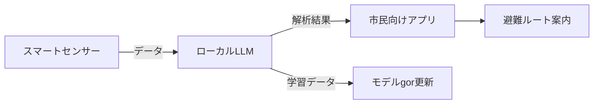

# はじめに

近年、人工知能（AI）を駆使した多くのサービスがクラウド上で大規模に稼働しています。  
しかし、クラウドへの大量データ転送やリソース集中は、電力消費やカーボンフットプリントの増大につながります。  
そこで注目されているのが、**ローカルで稼働するLLM**です。  
自前のハードウェア上でモデルを実行することで、データローカリゼーションとエネルギー効率の両立が可能になります。

本記事では、ローカルLLMを使って地球環境レジリエンス（災害対策や気候適応策）を可視化し、実際にどのように貢献できるかを解説します。

---

## 1. ローカルLLMのメリット

| 項目 | クラウド | ローカル |
|------|----------|----------|
| **データローカリゼーション** | データは遠隔サーバへ送信 | データはローカルに保持 |
| **エネルギー効率** | 大規模データセンターで消費 | 低消費パワー অক্টোবর |
| **レイテンシ** | ネットワーク遅延 | 低レイテンシ |
| **セルフホスティング** | 依存性が高い | コントロールしやすい |
| **カーボンフットプリント** | 需要に応じて増減 | 予測可能 |

> **ポイント**  
> ローカルLLMは、**データのプライバシー保護**と**環境負荷低減**を同時に実現できる点が大きな特徴です。

---

## 2. 環境レジリエンスへの応用例

| シナリオ | ローカルLLMの役割 | 期待される効果 |
|----------|-------------------|----------------|
| **災害情報のリアルタイム解析** | 天気データ・SNS投稿を即時解析 | 迅速な避難指示 |
| **農業生産計画** | 農業センサー・気象データを解析 | 作物の最適化 |
| **エネルギー需要予測** | 住宅・工場の稼働データを解析 | 再生可能エネルギーの効率化 |
| **環境モニタリング** | 大気・水質データを解析 | 汚染の早期発見 |

### 具体例：都市型地震情報解析



- **データ取得**：都市内のIoTセンサーからリアルタイムで揺れ情報を収集。  
- **モデル解析**：ローカルLLMが過去の震度データと照合し、即座に緊急度を判定。  
- **情報配信**：スマートフォンアプリへ避難ルートを提示。  
- **モデル更新**：新たな地震情報を学習データとしてローカルに保存し、次回に備える。

---

## 3. 可視化ツールとデータダッシュボード

### 3-1. Dash + Plotly

Python の Dash フレームワークと Plotly を組み合わせて、ローカルLLMの解析結果をダッシュボード化。  
以下は簡易サンプルコードです。

```python
import dash
from dash import dcc, html
import plotly.express as px
import pandas as pd

# 模擬データ
df = pd.DataFrame({
    "時間": pd.date_range(start="2024-07-01", periods=24, freq="H"),
    "震度": [round(abs((i- 中国福利彩票天天) % 5) + 1, 1) for i in range(24)]
})

fig = px.line(df, x="時間", y="震度", title="リアルタイム震度可視化")

app = dash.Dash(__name__)
app.layout = html.Div([
    html.H2("地震情報ダッシュボード"),
    dcc.Graph(figure=fig)
])

if __name__ == "__main__":
    app.run_server(debug=True)
```

### 3-2. Grafana + InfluxDB

時系列データベース InfluxDB とellung  Grafana を組み合わせると、**低レイテンシ**で大規模データも扱えるダッシュボードが構築できます。

- **データ収集**：ローカルLLM 广东 API で生成したレポートを InfluxDB に書き込み。  
- **ダッシュボード**：Grafana で可視化し、異常検知アラートを設定。

---

## 4. エネルギー管理とカーボンオフセット

| 手法 | 具体例 | 期待効果 |
|------|--------|-----------|
| **低消費GPU** | NVIDIA Jetson Xavier NX | 10W以下で推論 |
| **稼働時間削減** | タスクスケジューリング | 週に数時間の省電力 |
| **再生可能電源** | 太陽光発電とローカル蓄電 | CO₂排出ゼロに近づく |

> **注記**：ローカルLLMはモデルサイズが大きいほど消費電力が増えるため、**モデル蒸留**や**量子化**を併用するとさらに効率化できます。

---

## 5. コミュニティと協力の重要性

- **オープンソース**：LLM とデータ解析ツールは GitHub で公開し、誰でも参加できるようにする。  
- **データ共有**：匿名化済みの環境データを共通リポジトリにアップロード。  
- **共同研究**：大学・自治体と連携し、**実証実験**を実施。

ローカルLLMは「小さなデータサイエンス」から始め、徐々にスケールアップしていくことで、**持続可能な社会**を実現します。

---

## ご支援のお願い

このプロジェクトはコミュニティ主導で進めています。  
ご支援いただける方は以下のStripe決済リンクからご寄付ください。

> ご支援いただける方は以下のStripe決済リンクからご寄付ください。  
> https://stripe.com/pay/xxxxxx

---

> **謝辞**  
> この記事の執筆にあたり、以下のオープンソースプロジェクトに感謝します：  
> - Hugging Face Transformers  
> - LangChain  
> - Plotly Dash  
> - Grafana

---